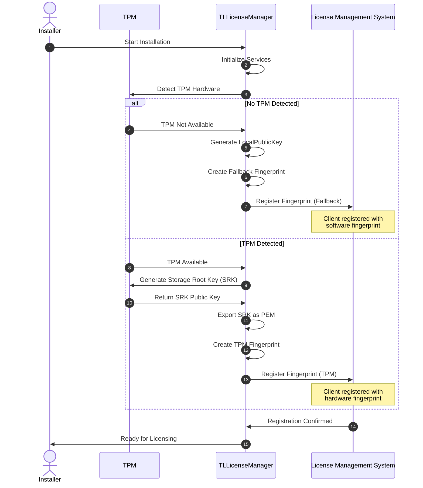

# Trusted Licensing Fingerprint Architecture

**Version:** 1.0  
**Created:** 1 February 2026  

**Document Purpose:** This document analyzes the fingerprint data creation flows, hardware identification mechanisms, registration processes, and security implications of fingerprint-based client identification in the TrustedLicensing system.

---

## Table of Contents

1. [Overview](#1-overview)
2. [Fingerprint Types](#2-fingerprint-types)
3. [Hardware Identification Components](#3-hardware-identification-components)
4. [Fingerprint Generation Flow](#4-fingerprint-generation-flow)
5. [Registration Process](#5-registration-process)
6. [Fingerprint Usage in License Delivery](#6-fingerprint-usage-in-license-delivery)
7. [Security Architecture](#7-security-architecture)
8. [Platform-Specific Implementation](#8-platform-specific-implementation)
9. [Custom Fingerprinting](#9-custom-fingerprinting)
10. [Troubleshooting](#10-troubleshooting)
11. [Related Documents](#11-related-documents)

---

## 1. Overview

Fingerprints in TrustedLicensing serve as unique hardware identifiers that bind licenses to specific client platforms. The fingerprint architecture provides two modes of operation: **TPM-based fingerprints** for hardware-backed security and **fallback fingerprints** for platforms without TPM support.

### 1.1 Purpose

**Primary Functions:**
- **Client Identification:** Uniquely identify TLLicenseManager instances
- **License Binding:** Cryptographically bind licenses to specific hardware
- **Package Encryption:** Encrypt license packages for destination-specific delivery
- **Registration:** Register clients with License Management System (LMS)
- **Anti-Portability:** Prevent unauthorized license transfer between systems

### 1.2 Fingerprint Modes

| Mode | Security Level | Hardware Required | Use Case |
|------|---------------|-------------------|----------|
| **TPM-Based** | High | TPM 2.0 | Production deployments |
| **Fallback (Software)** | Medium | None | Development, testing, non-TPM platforms |
| **Custom** | Vendor-defined | Varies | Specialized embedded systems, IoT devices |

**Source:** [Client Architecture.md](../../TLCloud/Client/Client%20Architecture.md "TLCloud/Client"), [TLLicenseManager_StartUp.md](../../TL2/_docs_dev/TLLicenseManager_StartUp.md "TL2/_docs_dev")

---

## 2. Fingerprint Types

### 2.1 TPM-Based Fingerprint (Primary)

**Generation Formula:**
```
Fingerprint_TPM = SHA256(
    CPU_ID +
    Motherboard_UUID +
    MAC_Address +
    Disk_Serial +
    SRK_PublicKey    ← TPM-generated RSA public key
)
```

**Characteristics:**

| Property | Value |
|----------|-------|
| **Hash Algorithm** | SHA-256 (32 bytes / 64 hex characters) |
| **Hardware Component** | TPM 2.0 chip |
| **Key Material** | Storage Root Key (SRK) public key (RSA 2048/3072-bit) |
| **Reproducibility** | ✅ Yes (deterministic from TPM seed) |
| **Security Level** | 🔒 High (hardware-backed) |
| **Tamper Resistance** | ✅ Strong (TPM attestation) |
| **OS Independence** | ✅ Yes (survives OS reinstallation) |
| **Portability** | ❌ No (bound to TPM hardware) |

**Security Benefits:**
- ✅ **Hardware-backed:** Private key never leaves TPM chip
- ✅ **Tamper-resistant:** TPM provides cryptographic attestation
- ✅ **Platform binding:** Licenses cryptographically bound to specific hardware
- ✅ **Firmware protection:** TPM PCR policies protect against firmware tampering
- ✅ **Clone prevention:** Impossible to duplicate TPM identity

**Source:** [TrustedLicensing_Client_Security_Cryptography.md](TrustedLicensing_Client_Security_Cryptography.md), [TLLicenseManager_StartUp.md](../../TL2/_docs_dev/TLLicenseManager_StartUp.md "TL2/_docs_dev")

---

### 2.2 Fallback Fingerprint (Software)

**Generation Formula:**
```
Fingerprint_Fallback = SHA256(
    CPU_ID +
    Motherboard_UUID +
    MAC_Address +
    Disk_Serial +
    LocalPublicKey   ← Software-generated RSA public key
)
```

**Characteristics:**

| Property | Value |
|----------|-------|
| **Hash Algorithm** | SHA-256 (32 bytes / 64 hex characters) |
| **Hardware Component** | None (software-based) |
| **Key Material** | LocalPublicKey from vault.bin (RSA 2048-bit) |
| **Reproducibility** | ✅ Yes (from persistence vault) |
| **Security Level** | 🔓 Medium (software-based) |
| **Tamper Resistance** | ⚠️ Weak (file-based storage) |
| **OS Independence** | ⚠️ Limited (depends on vault persistence) |
| **Portability** | ⚠️ Possible (vault.bin can be copied) |

**Security Trade-offs:**
- ⚠️ **Software storage:** Private key in vault.bin (AES-256-CBC encrypted)
- ⚠️ **Extraction risk:** Key vulnerable to software attacks
- ⚠️ **No attestation:** Cannot prove hardware authenticity
- ⚠️ **Migration risk:** Vault file can be copied to different hardware
- ⚠️ **Requires dedicated license feature:** Vendor must enable fallback mode

**Use Cases:**
- Development and testing environments
- Virtual machines without TPM pass-through
- Legacy hardware without TPM 2.0
- Embedded systems with custom security models
- Platforms where TPM is deliberately disabled

**Source:** [Client Architecture.md](../../TLCloud/Client/Client%20Architecture.md "TLCloud/Client"), [Crypto Entities.md](../../TLCloud/Architecture/Crypto%20Entities.md "TLCloud/Architecture")

---

### 2.3 Custom Fingerprint (Vendor-Specific)

**Implementation:**
```cpp
// Vendor registers custom fingerprint callback
void RegisterCustomFingerprint(std::function<std::string()> callback);

// Callback implementation example
std::string GetCustomFingerprint()
{
    // Vendor-specific hardware identification
    std::string hardwareSerial = ReadEmbeddedDeviceSerial();
    std::string securityToken = ReadCustomSecurityModule();
    
    return SHA256(hardwareSerial + securityToken);
}
```

**Characteristics:**
- **Implementation:** C++ registered callback mechanism
- **Flexibility:** Vendor-defined identification algorithm
- **Hardware:** Custom hardware IDs (e.g., security tokens, device serial numbers)
- **Security:** Vendor-controlled security model
- **Use Cases:** Specialized industrial equipment, IoT devices, embedded systems

**Source:** [Client Architecture.md](../../TLCloud/Client/Client%20Architecture.md "TLCloud/Client")

---

## 3. Hardware Identification Components

### 3.1 Hardware Identifiers Collected

The `TLFingerPrintService` collects the following hardware identifiers across all platforms:

| Component | Collection Method | Platform Support | Stability |
|-----------|------------------|------------------|-----------|
| **CPU ID** | `cpuid` instruction | Windows ✅, Linux ✅ | High (hardware-fixed) |
| **Motherboard UUID** | SMBIOS/DMI | Windows ✅, Linux ✅ | High (firmware-fixed) |
| **MAC Address** | Network interface query | Windows ✅, Linux ✅ | Medium (NIC replacement changes) |
| **Disk Serial** | Storage device query | Windows ✅, Linux ⚠️ | Medium (disk replacement changes) |
| **Hostname** | System API | Windows ✅, Linux ✅ | Low (user configurable) |

**Note:** Hostname is collected but not used in fingerprint calculation due to low stability.

**Source:** [InfraTodo.md](../../TLCloud/ToDo/InfraTodo.md "TLCloud/ToDo")

### 3.2 CPU ID Detection

**Windows:**
```cpp
// Use __cpuid intrinsic
int cpuInfo[4] = {0};
__cpuid(cpuInfo, 0);  // Get vendor string
__cpuid(cpuInfo, 1);  // Get processor info and feature bits
```

**Linux:**
```cpp
// Read from /proc/cpuinfo or use cpuid instruction
FILE* cpuinfo = fopen("/proc/cpuinfo", "r");
// Parse processor serial or use inline assembly
```

**References:**
- https://learn.microsoft.com/en-us/cpp/intrinsics/cpuid-cpuidex
- https://github.com/nemequ/portable-snippets/tree/master/cpu

**Source:** [InfraTodo.md](../../TLCloud/ToDo/InfraTodo.md "TLCloud/ToDo")

### 3.3 Motherboard UUID

**Windows (SMBIOS):**
```powershell
Get-WmiObject Win32_ComputerSystemProduct | Select-Object -ExpandProperty UUID
```

**Linux (DMI):**
```bash
sudo dmidecode -s system-uuid
# or
cat /sys/class/dmi/id/product_uuid
```

### 3.4 MAC Address

**Criteria:**
- First active physical network adapter
- Excludes virtual adapters (VMware, Hyper-V, Docker)
- Prefers Ethernet over WiFi

**Windows:**
```cpp
GetAdaptersInfo() → Filter physical adapters → Select first active
```

**Linux:**
```bash
ip link show | grep "link/ether" | head -n1
```

### 3.5 Disk Serial Number

**Windows:**
```cpp
// Use DeviceIoControl with IOCTL_STORAGE_QUERY_PROPERTY
STORAGE_DEVICE_DESCRIPTOR → SerialNumber
```

**Linux:**
```bash
# Implementation status: TODO (InfraTodo.md)
udevadm info --query=property --name=/dev/sda | grep ID_SERIAL
```

---

## 4. Fingerprint Generation Flow

### 4.1 Service Creation Flow

```
TLLicenseManager Startup (Phase 5: Key Generation)
│
├─ 1. Retrieve Fingerprint Keys
│  └─ GetFingerPrintKeys()
│     └─ Returns JSON:
│        {
│          "LocalPublicKey": "-----BEGIN PUBLIC KEY-----\n...",
│          "SRK": "-----BEGIN PUBLIC KEY-----\n..."  (if TPM connected)
│        }
│
├─ 2. Create Fingerprint Service
│  └─ spFingerPrintService = std::make_unique<TLFingerPrintService>(keys)
│     │
│     └─ Collect Hardware Identifiers:
│        ├─ CPU ID (cpuid instruction)
│        ├─ Motherboard UUID (SMBIOS/DMI)
│        ├─ MAC Address (first physical adapter)
│        ├─ Disk Serial (storage device query)
│        └─ Hostname (informational only)
│
├─ 3. Generate Fallback Fingerprint (always)
│  └─ ApplicationState::StoreFingerPrint(
│       FingerPrintType::Fallback,
│       spFingerPrintService->GetFingerPrint(Fallback)
│     )
│     │
│     └─ Calculation:
│        └─ SHA256(HardwareIDs + LocalPublicKey)
│           └─ HardwareIDs = CPU_ID + MB_UUID + MAC + Disk_Serial
│
└─ 4. Generate TPM Fingerprint (if TPM available)
   └─ IF ApplicationState::TPMConnected():
      └─ ApplicationState::StoreFingerPrint(
           FingerPrintType::TPM,
           spFingerPrintService->GetFingerPrint(TPM)
         )
         │
         └─ Calculation:
            └─ SHA256(HardwareIDs + SRK_PublicKey)
               ├─ SRK_PublicKey = TPM-exported X.509 PEM format
               └─ HardwareIDs = CPU_ID + MB_UUID + MAC + Disk_Serial
```

**Source:** [TLLicenseManager_StartUp.md](../../TL2/_docs_dev/TLLicenseManager_StartUp.md "TL2/_docs_dev")

### 4.2 Detailed Generation Steps

#### Step 1: Key Retrieval
```cpp
std::string GetFingerPrintKeys()
{
    json keys;
    
    // Always include LocalPublicKey (from vault.bin)
    keys["LocalPublicKey"] = wrapperlicenseManagerKeys->LocalPublicKey;
    
    // Include SRK if TPM connected
    if (wrapperlicenseManagerKeys->SRK != nullptr)
    {
        keys["SRK"] = wrapperlicenseManagerKeys->SRK;
    }
    
    return keys.dump();
}
```

#### Step 2: Hardware Collection
```cpp
class TLFingerPrintService
{
public:
    TLFingerPrintService(const std::string& keysJson)
    {
        // Parse keys
        keys_ = json::parse(keysJson);
        
        // Collect hardware identifiers
        hwInfo_.cpuId = GetCPUID();
        hwInfo_.motherboardUuid = GetMotherboardUUID();
        hwInfo_.macAddress = GetFirstPhysicalMAC();
        hwInfo_.diskSerial = GetSystemDiskSerial();
        hwInfo_.hostname = GetHostname();  // Not used in fingerprint
    }
};
```

#### Step 3: Fingerprint Calculation
```cpp
std::string TLFingerPrintService::GetFingerPrint(FingerPrintType type)
{
    // Concatenate hardware identifiers
    std::string hwData = 
        hwInfo_.cpuId + 
        hwInfo_.motherboardUuid + 
        hwInfo_.macAddress + 
        hwInfo_.diskSerial;
    
    // Add key material based on type
    if (type == FingerPrintType::TPM && keys_.contains("SRK"))
    {
        hwData += keys_["SRK"];  // SRK public key
    }
    else  // Fallback
    {
        hwData += keys_["LocalPublicKey"];  // Software public key
    }
    
    // Calculate SHA-256 hash
    return SHA256(hwData);
}
```

---

## 5. Registration Process

### 5.1 Registration Flow



**Source:** [LicenseManagerRegistrtion.mermaid.md](../../TLCloud/_uml/LicenseManagerRegistrtion.mermaid.md "TLCloud/_uml")

### 5.2 Registration API

**Client Request:**
```json
POST /api/v1/clients/register
{
  "fingerprint": "a1b2c3d4e5f6...sha256_hash",
  "fingerprintType": "TPM",
  "publicKey": "-----BEGIN PUBLIC KEY-----\n...\n-----END PUBLIC KEY-----",
  "clientInfo": {
    "hostname": "production-server-01",
    "platform": "Linux",
    "architecture": "x86_64",
    "tpmVersion": "2.0"
  }
}
```

**LMS Response:**
```json
{
  "clientId": "550e8400-e29b-41d4-a716-446655440000",
  "fingerprint": "a1b2c3d4e5f6...sha256_hash",
  "registeredAt": "2026-02-01T10:30:00Z",
  "status": "active"
}
```

### 5.3 LMS Storage

The License Management System stores:
- **Fingerprint Hash:** SHA-256 identifier (primary key)
- **Public Key:** SRK or LocalPublicKey (for package encryption)
- **Fingerprint Type:** TPM | Fallback | Custom
- **Client Metadata:** Hostname, platform, architecture
- **Registration Timestamp:** ISO 8601 format
- **Status:** Active | Suspended | Revoked

---

## 6. Fingerprint Usage in License Delivery

### 6.1 Package Encryption Workflow

```
License Package Creation (LMS)
│
├─ 1. License Generation
│  ├─ Generate license containers
│  ├─ Sign containers with Vendor Key
│  └─ Bundle containers into package
│
├─ 2. Retrieve Client Fingerprint
│  └─ Query LMS database:
│     SELECT publicKey FROM clients WHERE fingerprint = ?
│
├─ 3. Package Encryption
│  ├─ Sign package with LMS private key
│  └─ Encrypt package with Client Public Key (from fingerprint)
│     │
│     └─ IF TPM fingerprint:
│        │  └─ Encrypt with SRK Public Key
│        │     └─ Result: Only TPM can decrypt (hardware-bound)
│        │
│        ELSE Fallback fingerprint:
│           └─ Encrypt with LocalPublicKey
│              └─ Result: vault.bin private key required (software-bound)
│
└─ 4. Package Delivery
   └─ Deliver via HTTPS to TLLicenseManager REST API
```

**Source:** [Activation.md](../../TLCloud/LMS/Activation/Activation.md "TLCloud/LMS")

### 6.2 Package Decryption (Client-Side)

```
License Package Reception (TLLicenseManager)
│
├─ 1. Receive Package
│  └─ HTTPS POST to /api/v1/licenses/activate
│
├─ 2. Verify LMS Signature
│  └─ RSA signature verification with LMS public key
│
├─ 3. Decrypt Package
│  ├─ IF TPM fingerprint:
│  │  └─ tpm.RSA_Decrypt(package, SRK_Handle)
│  │     └─ Private key never leaves TPM
│  │
│  └─ ELSE Fallback fingerprint:
│     └─ RSA_Decrypt(package, LocalPrivateKey)
│        └─ Private key from vault.bin (AES decrypted)
│
├─ 4. Extract Containers
│  └─ Parse JSON license containers
│
├─ 5. Verify Vendor Signatures
│  └─ Verify each container with Vendor Public Key
│
└─ 6. Install Licenses
   └─ Store in license database and activate features
```

### 6.3 Hardware Binding Enforcement

**TPM-Based:**
- ✅ **Decryption requires TPM:** Package encrypted with SRK public key
- ✅ **Private key never exposed:** SRK private key stays in TPM chip
- ✅ **Hardware attestation:** TPM can prove authenticity
- ✅ **Clone protection:** Impossible to duplicate TPM identity

**Fallback-Based:**
- ⚠️ **Requires vault.bin:** LocalPrivateKey stored in encrypted file
- ⚠️ **Software-based security:** AES-256-CBC encryption of vault
- ⚠️ **Vault portability:** File can be copied (reduces binding strength)
- ⚠️ **No attestation:** Cannot prove hardware authenticity

**Source:** [Activation.md](../../TLCloud/LMS/Activation/Activation.md "TLCloud/LMS"), [TrustedLicensing_Client_Security_Cryptography.md](TrustedLicensing_Client_Security_Cryptography.md)

---

## 7. Security Architecture

### 7.1 Threat Model

#### Threats Mitigated (TPM Fingerprint) ✅

| Threat | Mitigation | Effectiveness |
|--------|-----------|---------------|
| **License cloning** | TPM hardware binding | High (private key extraction impossible) |
| **VM snapshot rollback** | Fingerprint persistence tracking | Medium (requires persistence monitoring) |
| **Hardware migration** | Fingerprint mismatch detection | High (different hardware = different fingerprint) |
| **Software tampering** | TPM attestation | High (firmware/software changes detected) |
| **Man-in-the-middle** | Package encryption with fingerprint | High (only target client can decrypt) |
| **Package replay** | Package GUID tracking | Medium (requires audit logging) |

#### Vulnerabilities (Fallback Fingerprint) ⚠️

| Vulnerability | Impact | Risk Level | Mitigation |
|--------------|--------|-----------|------------|
| **vault.bin extraction** | Private key compromise | High | Use TPM mode in production |
| **Hardware spoofing** | Fake hardware IDs | Medium | Require TPM attestation |
| **VM cloning** | License duplication | High | Monitor fingerprint registrations |
| **Vault file copying** | License portability | High | Implement server-side validation |
| **No hardware attestation** | Cannot prove authenticity | Medium | Use TPM for critical deployments |

**Source:** [TrustedLicensing_Client_Security_Cryptography.md](TrustedLicensing_Client_Security_Cryptography.md)

### 7.2 Security Best Practices

#### For Production Deployments:

1. **Prefer TPM Fingerprints:**
   - Always use TPM-based fingerprints for production systems
   - Hardware-backed security provides strongest protection
   - Enables attestation and tamper detection

2. **Validate Registration Requests:**
   - Implement rate limiting on registration endpoints
   - Monitor for suspicious registration patterns
   - Alert on duplicate fingerprint attempts

3. **Audit Fingerprint Usage:**
   - Log all fingerprint generation events
   - Track package decryption attempts
   - Monitor for fingerprint mismatches

4. **Revocation Strategy:**
   - Maintain revocation list for compromised fingerprints
   - Implement certificate revocation checking
   - Support remote license deactivation

#### For Fallback Mode:

1. **Restrict to Non-Critical Use:**
   - Development environments
   - Testing infrastructure
   - Non-production workloads

2. **Require Vendor Authorization:**
   - Dedicated license feature enables fallback mode
   - Document security implications
   - Implement additional server-side validation

3. **Strengthen Vault Security:**
   - Use strong AES keys (not hardcoded)
   - Implement key rotation
   - Monitor vault.bin access patterns

---

## 8. Platform-Specific Implementation

### 8.1 Windows Implementation

**Hardware Detection:**
```cpp
// CPU ID
int cpuInfo[4];
__cpuid(cpuInfo, 0);  // Vendor
__cpuid(cpuInfo, 1);  // Features

// Motherboard UUID (WMI)
IWbemLocator* pLoc = nullptr;
CoCreateInstance(CLSID_WbemLocator, ...);
// Query Win32_ComputerSystemProduct

// MAC Address
GetAdaptersInfo(&pAdapterInfo, &dwBufLen);

// Disk Serial
DeviceIoControl(hDevice, IOCTL_STORAGE_QUERY_PROPERTY, ...);
```

**TPM Access:**
```cpp
// Use Tpm2 library
Tbs_Context_Params params = { TBS_CONTEXT_VERSION_ONE, TBS_CONTEXT_PARAMS_INCLUDE_TPM_12_20 };
Tbsi_Context_Create(&params, &hContext);
```

### 8.2 Linux Implementation

**Hardware Detection:**
```cpp
// CPU ID
unsigned int eax, ebx, ecx, edx;
__get_cpuid(0, &eax, &ebx, &ecx, &edx);  // Vendor
__get_cpuid(1, &eax, &ebx, &ecx, &edx);  // Features

// Motherboard UUID
FILE* f = fopen("/sys/class/dmi/id/product_uuid", "r");
fgets(uuid, sizeof(uuid), f);

// MAC Address (excluding virtual)
struct ifaddrs* ifaddr;
getifaddrs(&ifaddr);
// Filter AF_PACKET with IFF_LOOPBACK=0

// Disk Serial (TODO - pending implementation)
// udevadm info --query=property --name=/dev/sda
```

**TPM Access:**
```cpp
// Use tpm2-tss library
TSS2_TCTI_CONTEXT* tcti = nullptr;
Tss2_TctiLdr_Initialize("device:/dev/tpm0", &tcti);
```

**Source:** [InfraTodo.md](../../TLCloud/ToDo/InfraTodo.md "TLCloud/ToDo")

### 8.3 Docker/Container Considerations

**Challenges:**
- Container MAC addresses are ephemeral
- CPU/Motherboard IDs may be inherited from host
- TPM access requires device pass-through (`/dev/tpm0`)
- Disk serial may not be available

**Recommended Approach:**
```yaml
# Docker Compose with TPM
services:
  license-manager:
    image: trustedlicensing/manager:latest
    devices:
      - /dev/tpm0:/dev/tpm0  # TPM pass-through
    volumes:
      - ./persistence:/var/lib/trustedlicensing/persistence  # Persistent storage
    environment:
      - TL_FINGERPRINT_MODE=TPM  # Force TPM mode
```

**Fallback for Containers:**
- Use software fingerprint mode
- Bind to persistent volume for vault.bin stability
- Consider custom fingerprint with container-specific IDs

**TODO:** Detect Persistence Move (InfraTodo.md)

**Source:** [InfraTodo.md](../../TLCloud/ToDo/InfraTodo.md "TLCloud/ToDo")

### 8.4 Virtual Machine Detection

**VM Hypervisor Detection:**
- Check CPUID for hypervisor bit
- Inspect motherboard vendor strings (e.g., "VMware", "QEMU", "VirtualBox")
- Analyze MAC address vendor prefixes (VMware: 00:50:56, VirtualBox: 08:00:27)

**VM Rollback Detection:**
- **Challenge:** VM snapshots can revert system state
- **Impact:** Licenses may be duplicated across snapshots
- **Mitigation Strategies:**
  - Monitor time discrepancies (system time jumps backward)
  - Track hypervisor log files for snapshot events
  - Implement server-side activation tracking
  - Analyze file system for inconsistencies

**References:**
- https://github.com/nemequ/portable-snippets/tree/master/cpu
- https://stackoverflow.com/questions/3668804/detecting-vmm-on-linux
- https://kb.vmware.com/s/article/1009458

**Source:** [FingerPrints.md](../../TLCloud/Client/FingerPrints.md "TLCloud/Client")

---

## 9. Custom Fingerprinting

### 9.1 Callback Registration API

**Vendor C++ SDK:**
```cpp
// TLLicenseClient callback registration
namespace TrustedLicensing
{
    // Custom fingerprint callback type
    using FingerprintCallback = std::function<std::string()>;
    
    // Register custom fingerprint provider
    void RegisterCustomFingerprint(FingerprintCallback callback);
    
    // Unregister custom fingerprint (revert to built-in)
    void UnregisterCustomFingerprint();
}
```

### 9.2 Implementation Example

**Embedded Device with Security Token:**
```cpp
#include <TrustedLicensing/Client.h>

std::string GetEmbeddedDeviceFingerprint()
{
    // Read device-specific serial number
    std::string deviceSerial = ReadEEPROMSerial(0x1000);
    
    // Read hardware security module ID
    std::string hsmId = QuerySecurityModule();
    
    // Read unique MAC from dedicated NIC
    std::string dedicatedMAC = ReadDedicatedNIC();
    
    // Combine and hash
    std::string combined = deviceSerial + hsmId + dedicatedMAC;
    return SHA256(combined);
}

int main()
{
    // Register custom fingerprint before initialization
    TrustedLicensing::RegisterCustomFingerprint(GetEmbeddedDeviceFingerprint);
    
    // Initialize license client
    TrustedLicensing::Initialize();
    
    // Normal license operations
    // ...
}
```

### 9.3 Use Cases for Custom Fingerprinting

| Use Case | Custom Hardware | Security Level | Rationale |
|----------|----------------|----------------|-----------|
| **Industrial IoT** | Device serial in EEPROM | High | Fixed hardware ID programmed at manufacturing |
| **Medical Devices** | FDA-regulated serial numbers | Very High | Regulatory compliance requirements |
| **Network Appliances** | Dedicated management NIC MAC | Medium | Stable identifier across firmware updates |
| **Embedded Systems** | SoC unique identifier | High | ARM TrustZone or similar secure element |
| **Smart Cards** | Card serial number | Very High | Cryptographic token with secure storage |

**Source:** [Client Architecture.md](../../TLCloud/Client/Client%20Architecture.md "TLCloud/Client")

---

## 10. Troubleshooting

### 10.1 Common Issues

#### Issue 1: Fingerprint Mismatch After Hardware Change

**Symptoms:**
- License activation fails with "Fingerprint mismatch" error
- Existing licenses become invalid
- TLLicenseManager reports fingerprint change

**Causes:**
- Network adapter replacement (MAC address changed)
- Storage device replacement (disk serial changed)
- Motherboard replacement (UUID changed)

**Resolution:**
1. Verify hardware changes with diagnostic command:
   ```bash
   # Linux
   tl-license-manager --diagnostic --fingerprint
   
   # Windows
   TLLicenseManager.exe /diagnostic /fingerprint
   ```

2. Contact license administrator to:
   - Deactivate old fingerprint in LMS
   - Register new fingerprint
   - Re-issue license packages

3. For planned hardware changes:
   - Export licenses before hardware replacement (if supported)
   - Use transferable license model (if available)
   - Coordinate with vendor for license migration

#### Issue 2: TPM Not Available (Fallback Mode Used)

**Symptoms:**
- Log message: "TPM not detected, using fallback fingerprint"
- Fingerprint type: "Fallback" instead of "TPM"
- Reduced security warnings

**Causes:**
- TPM disabled in BIOS/UEFI
- TPM driver not installed
- Virtualization without TPM pass-through
- Platform without TPM 2.0 hardware

**Resolution:**
1. **Enable TPM in BIOS:**
   - Reboot and enter BIOS/UEFI setup
   - Navigate to Security settings
   - Enable TPM 2.0 (may be labeled "fTPM", "PTT", or "Security Device")
   - Save and reboot

2. **Install TPM Driver (Windows):**
   ```powershell
   # Check TPM status
   Get-Tpm
   
   # Install driver if missing
   # Download from manufacturer website or Windows Update
   ```

3. **Install TPM Software Stack (Linux):**
   ```bash
   # Debian/Ubuntu
   sudo apt-get install tpm2-tools tpm2-abrmd
   
   # RHEL/CentOS
   sudo yum install tpm2-tools tpm2-abrmd
   
   # Verify TPM access
   tpm2_getcap properties-fixed
   ```

4. **Docker/VM TPM Pass-through:**
   ```yaml
   # Docker Compose
   devices:
     - /dev/tpm0:/dev/tpm0
   
   # Or configure VM to expose TPM device
   ```

#### Issue 3: Fingerprint Generation Fails

**Symptoms:**
- Error: "Failed to generate hardware fingerprint"
- TLLicenseManager fails to start
- Empty fingerprint value in logs

**Causes:**
- Insufficient permissions to read hardware information
- Missing hardware detection libraries
- Virtual environment with restricted hardware access

**Resolution:**
1. **Check Permissions (Linux):**
   ```bash
   # Grant read access to DMI information
   sudo chmod o+r /sys/class/dmi/id/*
   
   # Check TPM device permissions
   ls -l /dev/tpm0
   sudo chmod 666 /dev/tpm0  # Or add user to tpm group
   ```

2. **Install Dependencies:**
   ```bash
   # Linux - hardware detection tools
   sudo apt-get install dmidecode pciutils usbutils
   ```

3. **Run as Administrator/Root:**
   - Windows: Run TLLicenseManager as Administrator
   - Linux: Run with `sudo` or configure proper permissions

#### Issue 4: Duplicate Fingerprints (VM Cloning)

**Symptoms:**
- Multiple clients with same fingerprint
- License activation conflicts
- "Fingerprint already registered" errors

**Causes:**
- VM cloned after TLLicenseManager installation
- Container image baked with persistence data
- Manual copying of vault.bin file

**Resolution:**
1. **Regenerate Fingerprint:**
   ```bash
   # Delete persistence files
   rm -rf /var/lib/trustedlicensing/persistence/*
   
   # Restart TLLicenseManager (will regenerate keys)
   systemctl restart tl-license-manager
   ```

2. **Re-register with LMS:**
   - New fingerprint will be generated
   - Register new fingerprint with vendor
   - Deactivate old fingerprint if no longer in use

3. **Prevent Future Issues:**
   - Clone VMs before installing TLLicenseManager
   - Use configuration management to install after cloning
   - Exclude persistence directory from VM templates

### 10.2 Diagnostic Commands

**Generate Fingerprint Report:**
```bash
# Linux
tl-license-manager --diagnostic --fingerprint --output fingerprint.json

# Windows
TLLicenseManager.exe /diagnostic /fingerprint /output:fingerprint.json
```

**Example Output:**
```json
{
  "fingerprintType": "TPM",
  "fingerprintHash": "a1b2c3d4e5f6789012345678901234567890abcdefabcdefabcdefabcdef1234",
  "hardwareInfo": {
    "cpuId": "GenuineIntel_06_8E",
    "motherboardUuid": "550e8400-e29b-41d4-a716-446655440000",
    "macAddress": "00:1A:2B:3C:4D:5E",
    "diskSerial": "WD-ABC123DEF456",
    "hostname": "production-server-01"
  },
  "tpmInfo": {
    "available": true,
    "version": "2.0",
    "manufacturer": "Intel",
    "firmwareVersion": "7.63"
  },
  "publicKey": "-----BEGIN PUBLIC KEY-----\nMIIBIjANBgkqhkiG9w0BAQEFAAOCAQ8AMIIBCgKCAQEA...\n-----END PUBLIC KEY-----"
}
```

**Verify Fingerprint Calculation:**
```bash
# Manual verification (Linux)
echo -n "$CPU_ID$MB_UUID$MAC$DISK_SERIAL$SRK_PUBLIC" | sha256sum
```

---

## 11. Related Documents

- [Client Architecture.md](../../TLCloud/Client/Client%20Architecture.md) - Client topology and hardware security mechanisms
- [TrustedLicensing_Client_Security_Cryptography.md](TrustedLicensing_Client_Security_Cryptography.md) - Comprehensive security and cryptography documentation
- [TLLicenseManager_StartUp.md](../../TL2/_docs_dev/TLLicenseManager_StartUp.md) - Detailed startup sequence with fingerprint generation
- [Activation.md](../../TLCloud/LMS/Activation/Activation.md) - License activation and package encryption
- [Crypto Entities.md](../../TLCloud/Architecture/Crypto%20Entities.md) - Cryptographic key infrastructure
- [KeyRequired.md](../../TLCloud/Client/KeyRequired.md) - Key types and usage
- [TPM_Requirements.md](../../TLCloud/Client/TPM_Requirements.md) - TPM hardware and software requirements
- [InfraTodo.md](../../TLCloud/ToDo/InfraTodo.md) - Implementation status and pending work
- [LicenseManagerRegistrtion.mermaid.md](../../TLCloud/_uml/LicenseManagerRegistrtion.mermaid.md) - Visual registration flow
- [Packaging.mermaid.md](../../TLCloud/_uml/Packaging.mermaid.md) - Packaging architecture diagram

---

<!-- 
REGENERATION PROMPT:

Create comprehensive documentation for TrustedLicensing fingerprint architecture covering:

**Scope:**
- Fingerprint types: TPM-based, Fallback (software), Custom (vendor-specific)
- Hardware identification components: CPU ID, Motherboard UUID, MAC Address, Disk Serial
- Fingerprint generation flow during TLLicenseManager startup
- Registration process with License Management System (LMS)
- Usage in license package encryption and delivery
- Security architecture: threat model, vulnerabilities, best practices
- Platform-specific implementation: Windows, Linux, Docker/containers, VMs
- Custom fingerprinting with callback API
- Troubleshooting common issues

**Key Files to Review:**
- TL2/_docs_dev/TLLicenseManager_StartUp.md (Phase 5: fingerprint generation workflow)
- TLCloud/Client/Client Architecture.md (fingerprint alternatives, fallback mechanisms)
- TLCloud/Client/FingerPrints.md (hardware detection, VM detection)
- TLCloud/LMS/Activation/Activation.md (package encryption with fingerprint)
- TLCloud/Architecture/Crypto Entities.md (SRK vs LocalPublicKey)
- TLCloud/_uml/LicenseManagerRegistrtion.mermaid.md (registration sequence)
- TLCloud/ToDo/InfraTodo.md (implementation status, platform support)
- Generated/Dev Overview/TrustedLicensing_Client_Security_Cryptography.md (security model)

**Structure:**
1. Overview - Purpose, fingerprint modes, identification vs. binding
2. Fingerprint Types - TPM-based, Fallback, Custom with detailed characteristics
3. Hardware Identification Components - Collection methods, platform support, stability
4. Fingerprint Generation Flow - Service creation, calculation steps with code examples
5. Registration Process - Sequence diagram, API, LMS storage
6. Fingerprint Usage in License Delivery - Package encryption workflow, decryption, hardware binding
7. Security Architecture - Threat model, vulnerabilities, best practices
8. Platform-Specific Implementation - Windows, Linux, Docker, VM considerations
9. Custom Fingerprinting - Callback API, implementation examples, use cases
10. Troubleshooting - Common issues with symptoms/causes/resolutions, diagnostic commands
11. Related Documents - Cross-references to architecture, security, implementation docs

**Style:**
- Professional technical documentation with clear section hierarchy
- Include code examples (C++, bash, PowerShell) for key operations
- Use tables for comparison of fingerprint types, characteristics, platforms
- Include mermaid sequence diagram for registration process
- Provide security analysis with ✅ (mitigated) and ⚠️ (vulnerable) indicators
- Add troubleshooting section with actionable resolutions
- Cross-reference related documents with relative paths

**Update Triggers:**
- Changes to fingerprint generation algorithm
- New hardware identifier collection methods
- Platform support additions (new OS, container runtime)
- Security vulnerability discoveries
- Registration API changes
- Custom fingerprinting API modifications

Version: 1.0
Last Updated: 1 February 2026
-->
