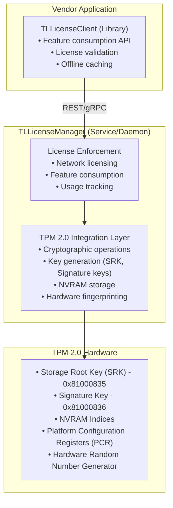
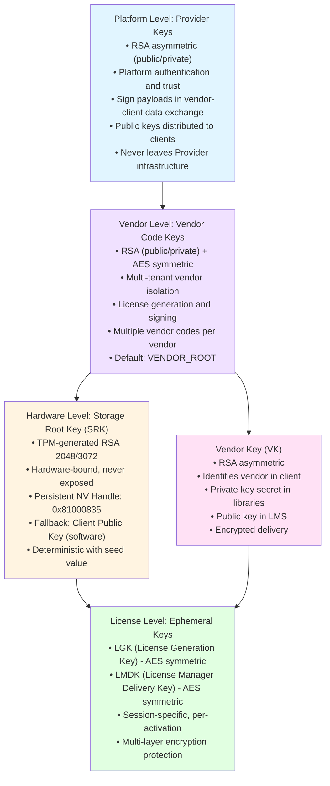
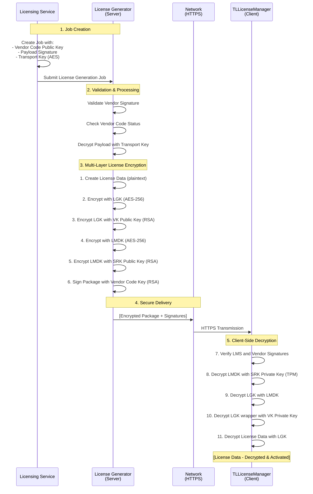

# Trusted Licensing Client Security and Cryptography

**Last Updated:** 31 January 2026 18:00

## 1. Client Architecture Overview

### 1.1 Component Topology

**Two-Component Design:**

#### TLLicenseManager (Service/Daemon)
- **Role:** Centralized license enforcement service
- **Privileges:** Requires elevated permissions (Administrator/root)
- **APIs:** REST (primary) + gRPC (future)
- **TPM Access:** Direct hardware access
- **Network Licensing:** Supports named user and station-based licensing
- **Platforms:** Windows service, Linux daemon, containerized deployment

**Source:** [Client Architecture.md](../../TLCloud/Client/Client%20Architecture.md "TLCloud/Client")

#### TLLicenseClient (Embedded Library)
- **Role:** Lightweight client for resource-constrained applications
- **Communication:** REST/gRPC to TLLicenseManager
- **Offline Capability:** Can operate with cached licenses
- **Integration:** Embedded in vendor applications
- **Security:** Inherits TLLicenseManager security mechanisms

**Source:** [Client Architecture.md](../../TLCloud/Client/Client%20Architecture.md "TLCloud/Client")

### 1.2 Architecture Diagram



**Source:** [TLLicenseManager_StartUp.md](../../TL2/_docs/TLLicenseManager_StartUp.md "TL2/_docs")

---

## 2. TPM 2.0 Integration

### 2.1 TPM Hardware Requirements

**TPM 2.0 Specification Compliance:**
- Compatible with TCG TPM 2.0 specification
- RSA 2048/3072-bit key support
- AES-256 symmetric encryption
- SHA-256 hashing algorithms
- HMAC operations
- Platform Configuration Registers (PCR)
- Non-volatile (NV) RAM storage

**Platform Support:**
- **Windows:** TPM driver (/dev/tpm0, /dev/tpmrm0)
- **Linux:** TPM character devices
- **Containers:** TPM device passthrough
- **Simulator:** Software TPM for testing

**Source:** [TPM_Requirements.md](../../TLCloud/Client/TPM_Requirements.md "TLCloud/Client"), [TPM_Docker_Kubernetes_Access.md](../../TL2/_docs/TPM_Docker_Kubernetes_Access.md "TL2/_docs")

### 2.2 TPM Device Access

#### Linux TPM Devices
```bash
# TPM device (direct access)
/dev/tpm0

# TPM Resource Manager (preferred, allows concurrent access)
/dev/tpmrm0

# Check TPM availability
ls -la /dev/tpm*

# Check TPM group permissions
stat -c '%G' /dev/tpmrm0

# Test TPM
tpm2_getcap properties-fixed
```

#### Docker TPM Passthrough
```yaml
services:
  tllicensemanager:
    image: tllicensemanager:latest
    devices:
      - /dev/tpm0:/dev/tpm0
      - /dev/tpmrm0:/dev/tpmrm0
    group_add:
      - tss  # TPM group
```

**Source:** [TPM_Docker_Kubernetes_Access.md](../../TL2/_docs/TPM_Docker_Kubernetes_Access.md "TL2/_docs")

### 2.3 TPM Operations Overview

**Core TPM Operations:**

| Operation | Purpose | TPM Command |
|-----------|---------|-------------|
| **CreatePrimary** | Generate Storage Root Key | `TPM2_CreatePrimary` |
| **EvictControl** | Persist key to NV storage | `TPM2_EvictControl` |
| **RSA_Encrypt** | Encrypt data with public key | `TPM2_RSA_Encrypt` |
| **RSA_Decrypt** | Decrypt data with private key | `TPM2_RSA_Decrypt` |
| **Sign** | Create digital signature | `TPM2_Sign` |
| **VerifySignature** | Verify signature | `TPM2_VerifySignature` |
| **NV_DefineSpace** | Create NVRAM index | `TPM2_NV_DefineSpace` |
| **NV_Write** | Write to NVRAM | `TPM2_NV_Write` |
| **NV_Read** | Read from NVRAM | `TPM2_NV_Read` |
| **GetRandom** | Hardware RNG | `TPM2_GetRandom` |
| **PCR_Read** | Read platform state | `TPM2_PCR_Read` |
| **HMAC** | Message authentication | `TPM2_HMAC` |

**Source:** [TLLicenseManager_StartUp.md](../../TL2/_docs/TLLicenseManager_StartUp.md "TL2/_docs")

---

## 3. Cryptographic Key Infrastructure

### 3.1 Key Hierarchy Overview

The TrustedLicensing platform implements a sophisticated multi-layer cryptographic key hierarchy that provides strong isolation between platform operations, vendor tenants, hardware binding, and ephemeral license operations:



**Source:** [Crypto Entities.md](../../TLCloud/Architecture/Crypto%20Entities.md "TLCloud/Architecture"), [KeyRequired.md](../../TLCloud/Client/KeyRequired.md "TLCloud/Client")

---

### 3.2 Platform Level: Provider Keys

**Purpose:** Platform-level authentication and trust establishment for data exchange between the Provider and vendor clients.

**Key Characteristics:**
- **Type:** RSA Asymmetric (public/private key pair)
- **Algorithm:** RSA
- **Purpose:** Sign payloads during data exchange between vendor and vendor client
- **Usage:** Platform-level authentication and data integrity verification
- **Storage Location:** VendorBoard (secure key vault)

**Security Characteristics:**
- ✅ Private key never leaves Provider infrastructure
- ✅ Public key distributed to vendors for signature verification
- ✅ Used for platform-level trust establishment
- ✅ Enables verification of platform-issued information
- ✅ Foundation of platform security model

**Use Cases:**
- Signing platform configuration data
- Authenticating platform-issued licenses
- Establishing trust chain for vendor operations
- Verifying data integrity in client-platform communications

**Source:** [Crypto Entities.md](../../TLCloud/Architecture/Crypto%20Entities.md "TLCloud/Architecture")

---

### 3.3 Vendor Level: Vendor Code Keys

**Purpose:** Vendor-specific license generation and multi-tenant isolation.

**Key Characteristics:**
- **Type:** RSA Asymmetric (public/private) + AES Symmetric
- **Algorithm:** RSA + AES
- **Purpose:** Vendor-specific generation of licenses and client assets (e.g., license managers)
- **Storage Location:** VendorBoard (secure key vault)

**Multi-Tenancy Architecture:**
- **Vendor Independence:** Vendors are independent tenants from the Provider's perspective
- **Multiple Vendor Codes:** Vendors can provision multiple vendor codes as required
- **Organizational Separation:** Use case: Separate business units or product lines within vendor organization
- **Default Code:** `VENDOR_ROOT` (recommended for testing and development)
- **Client Transmission:** Vendor code information is transmitted to client during license activation
- **Isolated Coexistence:** Licenses generated with different vendor codes are isolated but can coexist in the same infrastructure

**Security Model:**
- ✅ Each vendor code creates an isolated trust boundary
- ✅ Compromised vendor code affects only licenses generated with that specific code
- ✅ Enables granular security and organizational separation
- ✅ Private keys must be protected with strict access controls
- ✅ License Generator uses vendor code public key to encrypt licenses
- ✅ Supports vendor-specific cryptographic policies

**Operational Considerations:**
- Vendor codes enable business unit separation
- Different product lines can have isolated licensing
- Testing and production can use separate vendor codes
- Migration between vendor codes requires re-issuance of licenses

**Source:** [Crypto Entities.md](../../TLCloud/Architecture/Crypto%20Entities.md "TLCloud/Architecture"), [LicenseGeneration.md](../../TLCloud/Architecture/LicenseGeneration.md "TLCloud/Architecture")

---

### 3.4 Vendor Key (VK)

**Purpose:** Identifies the vendor in client libraries and enables license consumption verification.

**Key Characteristics:**
- **Type:** RSA Asymmetric (public/private key pair)
- **Algorithm:** RSA
- **Purpose:** Vendor identification and license verification in client
- **Storage Location (Private):** Embedded in client libraries (encrypted, protected)
- **Storage Location (Public):** License Management System (LMS)
- **Delivery:** Encrypted download for vendor

**Security Characteristics:**
- ✅ Private key is secret, embedded in client libraries
- ✅ Public key registered in LMS for verification
- ✅ Allows consumption of licenses for the specified vendor only
- ✅ Encrypted delivery mechanism protects key distribution
- ✅ Vendor-specific binding prevents cross-vendor license usage

**Operational Role:**
- Client libraries verify licenses using vendor public key
- Prevents unauthorized vendor license consumption
- Enables vendor-specific feature enforcement
- Supports multi-vendor deployment scenarios

**Source:** [KeyRequired.md](../../TLCloud/Client/KeyRequired.md "TLCloud/Client"), [Crypto Entities.md](../../TLCloud/Architecture/Crypto%20Entities.md "TLCloud/Architecture")

---

### 3.5 Hardware Level: Storage Root Key (SRK)

**Purpose:** Hardware-bound cryptographic operations with TPM security guarantees.

**Key Characteristics:**
- **Type:** RSA Asymmetric (2048/3072-bit)
- **Generation:** TPM hardware CreatePrimary operation
- **Storage:** TPM NVRAM persistent handle 0x81000835 (slot 2101)
- **Private Key:** Never leaves TPM chip
- **Public Key:** Exported as X.509 PEM format
- **Reproducibility:** Deterministic with seed value (TPM_SEED)
- **Algorithm:** RSA with OAEP-SHA256 padding scheme

**Generation Process:**
```cpp
// TPM SRK Template
TPMT_PUBLIC srkTemplate(
    TPM_ALG_ID::RSA,              // Algorithm
    TPM_ALG_ID::SHA256,           // Name algorithm  
    TPMA_OBJECT::decrypt |        // Can decrypt
    TPMA_OBJECT::restricted |     // Restricted parent
    TPMA_OBJECT::fixedTPM |      // Cannot be duplicated
    TPMA_OBJECT::fixedParent |   // Parent fixed
    TPMA_OBJECT::sensitiveDataOrigin | // TPM generates key
    TPMA_OBJECT::userWithAuth,   // Requires auth
    null,                         // No policy
    TPMS_RSA_PARMS(             // RSA parameters
        null,                     // No symmetric
        TPMS_SCHEME_OAEP(TPM_ALG_ID::SHA256), // OAEP scheme
        2048,                     // Key size
        0                         // Exponent (default 65537)
    ),
    TPM2B_PUBLIC_KEY_RSA()       // No pre-defined public area
);

// Create primary key with deterministic seed
auto rsaKey = tpm.CreatePrimary(
    TPM_RH::OWNER,               // Owner hierarchy
    TPMS_SENSITIVE_CREATE(auth, seed), // Auth + seed
    srkTemplate,                 // Template
    null,                        // No data
    null                         // No PCR selection
);

// Persist to NV handle
TPM_HANDLE persistHandle = TPM_HANDLE::Persistent(2101); // 0x81000835
tpm.EvictControl(TPM_RH::OWNER, rsaKey.handle, persistHandle);
```

**Key Features:**
- ✅ Survives reboots (persistent NV storage)
- ✅ Same seed → Same key pair (reproducible)
- ✅ Private key never exposed
- ✅ Can be re-created on TPM reset
- ✅ Platform independent
- ✅ Hardware attestation capable
- ✅ Tamper-resistant operations

**TPM Operations Supported:**
- RSA encryption/decryption
- Digital signatures (with separate signing key)
- Hardware fingerprinting
- Secure key wrapping
- License binding

**Source:** [TLLicenseManager_StartUp.md](../../TL2/_docs_dev/TLLicenseManager_StartUp.md "TL2/_docs_dev"), [KeyRequired.md](../../TLCloud/Client/KeyRequired.md "TLCloud/Client"), [Crypto Entities.md](../../TLCloud/Architecture/Crypto%20Entities.md "TLCloud/Architecture")

---

### 3.6 Client Fallback: Client Public Key (Local Public Key)

**Purpose:** Fallback mechanism for platforms without TPM support.

**Key Characteristics:**
- **Type:** RSA Asymmetric (public/private key pair)
- **Algorithm:** RSA (typically 2048-bit)
- **Purpose:** Fallback mechanism for platforms without TPM support
- **Storage Location:** Local persistence vault (vault.bin, software-based, AES-encrypted)

**Fallback Mechanism:**
- ✅ Used on platforms lacking TPM 2.0 hardware support
- ✅ Provides functional licensing with reduced security compared to TPM
- ⚠️ Requires dedicated license enablement from vendor
- ✅ Suitable for development, testing, and non-critical deployments
- ✅ Allows licensing on embedded systems without TPM
- ✅ Supports custom hardware platforms

**Security Trade-offs:**
- ⚠️ Less secure than TPM-based approach
- ⚠️ Private key stored in software (vulnerable to extraction)
- ⚠️ No hardware attestation capabilities
- ⚠️ Should be used only when TPM is unavailable
- ⚠️ Requires additional vendor authorization
- ⚠️ Increased risk of key compromise

**Use Cases:**
- Development and testing environments
- Platforms without TPM 2.0 support
- Virtualized environments where TPM is not available
- Legacy hardware compatibility
- Embedded systems with custom security models

**Source:** [Crypto Entities.md](../../TLCloud/Architecture/Crypto%20Entities.md "TLCloud/Architecture"), [TLLicenseManager_StartUp.md](../../TL2/_docs_dev/TLLicenseManager_StartUp.md "TL2/_docs_dev")

---

### 3.7 License Level: Ephemeral Keys

#### License Generation Key (LGK) - Symmetric
- **Type:** AES-256 symmetric key
- **Purpose:** Encrypt license payload data
- **Lifetime:** Session-specific, ephemeral (per-license)
- **Generation:** License Management System creates per-license
- **Usage:** First layer of license data encryption
- **Security:** Wrapped by LMDK for transmission

#### License Manager Delivery Key (LMDK) - Symmetric
- **Type:** AES-256 symmetric key
- **Purpose:** Wrap/encrypt the LGK for secure transmission
- **Lifetime:** Session-specific, ephemeral (per-activation)
- **Generation:** License Management System creates per-activation
- **Usage:** Second layer wrapping LGK
- **Security:** Encrypted with SRK (TPM) public key for hardware binding

**Ephemeral Key Benefits:**
- ✅ New keys for each license generation
- ✅ No key reuse across activations
- ✅ Compromised key affects only single activation
- ✅ Forward secrecy for license distribution
- ✅ Automatic key rotation per operation
- ✅ Minimal key management overhead

**Source:** [KeyRequired.md](../../TLCloud/Client/KeyRequired.md "TLCloud/Client"), [LicenseGeneration.md](../../TLCloud/Architecture/LicenseGeneration.md "TLCloud/Architecture")

---

### 3.8 Multi-Layer Encryption Flow

**License Creation and Delivery:**

The license generation process involves secure data exchange between the Licensing Service and License Generator, ensuring vendor authentication, payload encryption, and client-specific binding. The complete workflow is documented in detail in [LicenseGeneration.md](../../TLCloud/Architecture/LicenseGeneration.md "TLCloud/Architecture") and visualized in [LicenseGenerationFlow.md](../../TLCloud/Architecture/LicenseGenerationFlow.md "TLCloud/Architecture").

**Encryption Layers:**



**Encryption Sequence Details:**

**Server-Side (License Generator):**
1. **Plaintext Creation:** License data (features, entitlements, expiration)
2. **Layer 1 - LGK Encryption:** `Encrypted_License = AES256_Encrypt(LicenseData, LGK)`
3. **Layer 2 - VK Wrapping:** `Encrypted_LGK = RSA_Encrypt(LGK, VendorKey_Public)`
4. **Layer 3 - LMDK Encryption:** `Package_Layer1 = AES256_Encrypt(Encrypted_LGK + Encrypted_License, LMDK)`
5. **Layer 4 - SRK Binding:** `Package_Final = RSA_Encrypt(LMDK, SRK_Public)`
6. **Digital Signature:** `Signature = RSA_Sign(Package_Final, VendorCodeKey_Private)`

**Client-Side (TLLicenseManager):**
1. **Signature Verification:** `Verify(Signature, VendorCodeKey_Public) → Must pass`
2. **Layer 1 - LMDK Decryption:** `LMDK = TPM_RSA_Decrypt(Package_Final, SRK_Private)` ← Hardware-bound
3. **Layer 2 - LMDK Unwrapping:** `Encrypted_LGK + Encrypted_License = AES256_Decrypt(Package_Layer1, LMDK)`
4. **Layer 3 - VK Unwrapping:** `LGK = RSA_Decrypt(Encrypted_LGK, VendorKey_Private)`
5. **Layer 4 - License Decryption:** `LicenseData = AES256_Decrypt(Encrypted_License, LGK)`

**Security Benefits:**
- ✅ **End-to-end confidentiality:** Data encrypted from generation to activation
- ✅ **Hardware-bound decryption:** SRK private key in TPM required for LMDK
- ✅ **Vendor-specific licenses:** VK ensures vendor code isolation
- ✅ **Multi-layer defense:** Compromise of single layer insufficient
- ✅ **Key exposure compartmentalization:** Each key protects limited scope
- ✅ **Cryptographic signature verification:** Authenticity guaranteed
- ✅ **Session-specific keys:** LGK and LMDK unique per activation
- ✅ **Platform authentication:** Provider keys verify platform data

**Security Properties:**
- **Confidentiality:** Multi-layer AES + RSA encryption
- **Integrity:** Digital signatures from Vendor Code Key
- **Authenticity:** Signature verification required
- **Non-repudiation:** Signed by License Generator
- **Hardware Binding:** SRK ensures device-specific activation
- **Forward Secrecy:** Ephemeral keys (LGK, LMDK) prevent retroactive decryption

**Source:** [KeyRequired.md](../../TLCloud/Client/KeyRequired.md "TLCloud/Client"), [LicenseGeneration.md](../../TLCloud/Architecture/LicenseGeneration.md "TLCloud/Architecture"), [LicenseGenerationFlow.md](../../TLCloud/Architecture/LicenseGenerationFlow.md "TLCloud/Architecture")

---

## 4. TPM Startup Sequence

### 4.1 TLLicenseManager Initialization

**Complete Startup Flow:**

```
main() Entry Point
│
├─ Phase 1: Command-Line Processing
│  ├─ Parse arguments (--help, --version, --config, --rest-port, --log-level, --no-tpm)
│  ├─ Initialize logging (TLLogger::InitLogging)
│  ├─ Check elevation (Administrator/root required)
│  └─ Process --no-tpm flag early
│
├─ Phase 2: Application Initialization
│  ├─ Load TLLicenseManager.json configuration
│  ├─ Apply CLI overrides to config
│  ├─ Create LicenseService instance
│  └─ Detect runtime context (container vs. host)
│
├─ Phase 3: Persistence Layer Initialization
│  ├─ Initialize PersistenceService
│  ├─ Create or load persistence.bin (AES-encrypted secrets)
│  │  • TPM_SEED (deterministic key generation)
│  │  • TPM_AUTH (key authorization)
│  │  • AES keys (vault encryption)
│  └─ Skip TPM if --no-tpm flag set
│
├─ Phase 4: TPM Initialization
│  ├─ Connect to TPM device (/dev/tpmrm0 or simulator)
│  ├─ Execute tpm.Startup(TPM_SU::CLEAR)
│  ├─ Read PCR values (boot attestation)
│  └─ Check for persistent keys
│
├─ Phase 5: Key Generation
│  ├─ Generate local RSA key pair (software, vault.bin)
│  ├─ Generate TPM Storage Root Key (SRK)
│  │  • NV Handle: 0x81000835 (slot 2101)
│  │  • Deterministic with TPM_SEED
│  │  • Export public key as PEM
│  ├─ Generate TPM Signature Key (optional)
│  │  • NV Handle: 0x81000836 (slot 2102)
│  ├─ Store keys in vault.bin (AES-encrypted)
│  └─ Generate hardware fingerprints
│     ├─ Fallback: SHA256(HW_IDs + LocalPublicKey)
│     └─ TPM: SHA256(HW_IDs + SRK_PublicKey)
│
├─ Phase 6: Service Startup
│  ├─ Start REST API server (default port 52014)
│  ├─ Optional: Start gRPC server
│  ├─ Register API endpoints
│  └─ Log: "TLLicenseManager ready"
│
└─ Phase 7: Service Loop
   └─ Run until shutdown signal
```

**Source:** [TLLicenseManager_StartUp.md](../../TL2/_docs/TLLicenseManager_StartUp.md "TL2/_docs")

### 4.2 Persistent Key Storage

**NV Handle Allocation:**
```
TPM NV Handle Range: 0x81000000 - 0x81FFFFFF

Application Allocation:
• SRK:           0x81000835 (slot 2101)
• Signature Key: 0x81000836 (slot 2102)
• Reserved:      0x81000837-0x8100089B (slots 2103-3000)
```

**Key Persistence Workflow:**
```cpp
// First boot: Create and persist
auto rsaKey = tpm.CreatePrimary(TPM_RH::OWNER, sensCreate, template, null, seed);
TPM_HANDLE persistHandle = TPM_HANDLE::Persistent(2101);
tpm.EvictControl(TPM_RH::OWNER, rsaKey.handle, persistHandle);

// Subsequent boots: Load from NV
TPM_HANDLE srkHandle = TPM_HANDLE::Persistent(2101);
srkHandle.SetAuth(TPM_AUTH);
// Key is immediately available, no CreatePrimary needed
```

**Benefits:**
- ✅ Survives reboots
- ✅ Fast startup (no re-generation)
- ✅ Consistent key handles
- ✅ No transient memory allocation

**Source:** [TLLicenseManager_StartUp.md](../../TL2/_docs/TLLicenseManager_StartUp.md "TL2/_docs")

---

## 5. Cryptographic Operations

### 5.1 RSA Encryption and Decryption

**Encryption (RSA-OAEP with SHA-256):**
```cpp
TPMResponseVal<std::string> EncryptSRK(const std::string& payload)
{
    TPM_HANDLE srkHandle = TPM_HANDLE::Persistent(2101);
    srkHandle.SetAuth(TPM_AUTH);
    
    TPMS_SCHEME_OAEP scheme(TPM_ALG_ID::SHA256);
    
    ByteVec encrypted = tpm.RSA_Encrypt(
        srkHandle,
        String2ByteVec(payload),
        scheme,
        null  // no label
    );
    
    return ByteVec2String(encrypted);
}
```

**Decryption:**
```cpp
TPMResponseVal<std::string> DecryptSRK(const std::string& ciphertext)
{
    TPM_HANDLE srkHandle = TPM_HANDLE::Persistent(2101);
    srkHandle.SetAuth(TPM_AUTH);
    
    TPMS_SCHEME_OAEP scheme(TPM_ALG_ID::SHA256);
    
    ByteVec decrypted = tpm.RSA_Decrypt(
        srkHandle,
        String2ByteVec(ciphertext),
        scheme,
        null
    );
    
    return ByteVec2String(decrypted);
}
```

**Source:** [TLLicenseManager_StartUp.md](../../TL2/_docs/TLLicenseManager_StartUp.md "TL2/_docs")

### 5.2 Digital Signatures

**Signing (RSASSA with SHA-256):**
```cpp
TPMResponseVal<std::string> Sign(const std::string& data)
{
    TPM_HANDLE sigKey = TPM_HANDLE::Persistent(2102);
    sigKey.SetAuth(TPM_AUTH);
    
    TPMT_SIG_SCHEME scheme(TPM_ALG_ID::RSASSA, TPM_ALG_ID::SHA256);
    
    ByteVec digest = SHA256(data);
    
    auto signature = tpm.Sign(
        sigKey,
        digest,
        scheme,
        TPMT_TK_HASHCHECK::NullTicket()
    );
    
    return signature.signature.toBytes();
}
```

**Verification:**
```cpp
bool VerifySignature(const std::string& data, const std::string& signature)
{
    TPM_HANDLE sigKey = TPM_HANDLE::Persistent(2102);
    
    TPMT_SIG_SCHEME scheme(TPM_ALG_ID::RSASSA, TPM_ALG_ID::SHA256);
    
    ByteVec digest = SHA256(data);
    
    auto result = tpm.VerifySignature(
        sigKey,
        digest,
        TPMT_SIGNATURE::fromBytes(signature)
    );
    
    return result.isValid();
}
```

**Source:** [TLLicenseManager_StartUp.md](../../TL2/_docs/TLLicenseManager_StartUp.md "TL2/_docs")

### 5.3 NVRAM Operations

**Define NVRAM Index:**
```cpp
void DefineNVSpace(UINT32 index, UINT16 size, TPM_HANDLE authHandle)
{
    TPM2B_AUTH auth = String2Auth(TPM_AUTH);
    
    TPMS_NV_PUBLIC nvPublic(
        index,                          // NV index
        TPM_ALG_ID::SHA256,            // Name algorithm
        TPMA_NV::AUTHREAD |            // Require auth to read
        TPMA_NV::AUTHWRITE |           // Require auth to write
        TPMA_NV::ORDERLY,              // Orderly updates
        null,                           // No policy
        size                            // Data size
    );
    
    tpm.NV_DefineSpace(authHandle, auth, nvPublic);
}
```

**Write to NVRAM:**
```cpp
void WriteNV(UINT32 index, const ByteVec& data)
{
    TPM_HANDLE nvHandle = TPM_HANDLE::NVIndex(index);
    nvHandle.SetAuth(TPM_AUTH);
    
    tpm.NV_Write(
        nvHandle,
        nvHandle,
        data,
        0  // offset
    );
}
```

**Read from NVRAM:**
```cpp
ByteVec ReadNV(UINT32 index, UINT16 size)
{
    TPM_HANDLE nvHandle = TPM_HANDLE::NVIndex(index);
    nvHandle.SetAuth(TPM_AUTH);
    
    return tpm.NV_Read(
        nvHandle,
        nvHandle,
        size,
        0  // offset
    );
}
```

**Source:** [TLLicenseManager_StartUp.md](../../TL2/_docs/TLLicenseManager_StartUp.md "TL2/_docs")

### 5.4 Hardware Random Number Generation

```cpp
ByteVec GetRandom(UINT16 numBytes)
{
    return tpm.GetRandom(numBytes);
}

// Generate 32-byte random seed
ByteVec seed = tpm.GetRandom(32);

// Generate 16-byte AES key
ByteVec aesKey = tpm.GetRandom(16);
```

**Source:** [TLLicenseManager_StartUp.md](../../TL2/_docs/TLLicenseManager_StartUp.md "TL2/_docs")

---

## 6. Hardware Fingerprinting

### 6.1 Fingerprint Types

**Two Fingerprint Modes:**

#### TPM-Based Fingerprint (Primary)
```
Fingerprint = SHA256(
    CPU_ID +
    Motherboard_UUID +
    MAC_Address +
    Disk_Serial +
    SRK_PublicKey    ← TPM-generated
)
```

**Characteristics:**
- Hardware-bound (requires TPM)
- Most secure
- Resistant to software tampering
- Platform independent (OS changes allowed)

#### Fallback Fingerprint (Software)
```
Fingerprint = SHA256(
    CPU_ID +
    Motherboard_UUID +
    MAC_Address +
    Disk_Serial +
    LocalPublicKey   ← Software-generated
)
```

**Characteristics:**
- No TPM required
- Less secure than TPM
- Suitable for non-TPM environments
- Requires dedicated license enablement

**Source:** [FingerPrints.md](../../TLCloud/Client/FingerPrints.md "TLCloud/Client"), [TLLicenseManager_StartUp.md](../../TL2/_docs/TLLicenseManager_StartUp.md "TL2/_docs")

### 6.2 Custom Fingerprinting

**Vendor-Specific Fingerprinting:**
- C++ registered callback mechanism
- Vendor implements custom hardware identification
- Replaces built-in fingerprint algorithm
- Useful for specialized hardware platforms

**Use Cases:**
- Embedded systems with custom hardware IDs
- Specialized industrial equipment
- IoT devices with unique identifiers
- Custom security tokens

**Source:** [Client Architecture.md](../../TLCloud/Client/Client%20Architecture.md "TLCloud/Client")

---

## 7. Security Mechanisms

### 7.1 Storage Security

#### TPM-Based Storage
- **Technology:** TPM 2.0 Non-Volatile (NV) storage
- **Encryption:** Hardware-backed, inside TPM chip
- **Access Control:** Authorization values (TPM_AUTH)
- **Persistence:** Survives OS reinstallation
- **Benefits:**
  - OS independence
  - Hardware binding
  - Tamper resistance
  - Secure key storage

**Source:** [Client Architecture.md](../../TLCloud/Client/Client%20Architecture.md "TLCloud/Client")

#### Vault-Based Storage
- **File:** vault.bin (encrypted with AES-256)
- **Contents:**
  - LocalPublicKey (RSA public key)
  - LocalPrivateKey (RSA private key, encrypted)
  - SRK (TPM public key export)
- **Encryption:** AES keys from persistence.bin
- **Location:** Application data directory

**Source:** [TLLicenseManager_StartUp.md](../../TL2/_docs/TLLicenseManager_StartUp.md "TL2/_docs")

#### Persistence Layer
- **File:** persistence.bin (encrypted with AES-256)
- **Contents:**
  - TPM_SEED (deterministic key generation)
  - TPM_AUTH (key authorization value)
  - AES encryption keys
  - Configuration secrets
- **First-Time Initialization:**
  ```cpp
  // Generate random seeds
  TPM_SEED = GetRandom(32);  // 256-bit
  TPM_AUTH = GetRandom(20);  // 160-bit
  AES_KEY = GetRandom(32);   // 256-bit
  
  // Encrypt and store
  EncryptAndSave(persistence.bin, {TPM_SEED, TPM_AUTH, AES_KEY});
  ```

**Source:** [TLLicenseManager_StartUp.md](../../TL2/_docs/TLLicenseManager_StartUp.md "TL2/_docs")

### 7.2 Anti-Tampering Mechanisms

#### Virtual Machine Rollback Detection
- **Threat:** VM snapshot rollback to reuse consumed licenses
- **Detection Methods:**
  - TPM monotonic counters (cannot be rolled back)
  - NVRAM write tracking
  - Time inconsistency detection
  - Platform attestation changes
  - PCR value verification

**TPM Advantages:**
- TPM counters are strictly monotonic
- NVRAM indices detect state inconsistencies
- PCR values change with system state
- Platform attestation can detect VM manipulation

**Source:** [FingerPrints.md](../../TLCloud/Client/FingerPrints.md "TLCloud/Client")

#### Platform Configuration Registers (PCR)
```cpp
// Read PCR values
auto pcrValues = tpm.PCR_Read({0, 1, 2, 3, 4, 5, 6, 7});

// Verify expected boot state
bool VerifyBootState(const std::vector<ByteVec>& expectedPCRs)
{
    auto currentPCRs = tpm.PCR_Read({0, 1, 2, 3, 4, 5, 6, 7});
    
    for (size_t i = 0; i < expectedPCRs.size(); i++) {
        if (currentPCRs[i] != expectedPCRs[i]) {
            return false;  // Boot state changed
        }
    }
    
    return true;
}
```

**PCR Usage:**
- Boot integrity verification
- Firmware tampering detection
- Secure boot validation
- Configuration change detection

**Source:** [TLLicenseManager_StartUp.md](../../TL2/_docs/TLLicenseManager_StartUp.md "TL2/_docs")

### 7.3 Secrets Management

**HashiCorp Vault Integration:**
- Platform-level secrets storage
- Namespace-based isolation
- Instance-specific secrets
- Service configuration

**Encrypted Configuration:**
- Provider-encrypted configuration
- Vendor-encrypted configuration
- Decrypted on client using TPM-backed keys

**Source:** [Client Architecture.md](../../TLCloud/Client/Client%20Architecture.md "TLCloud/Client")

---

## 8. API Security and Authentication

### 8.1 Client REST API

**Default Configuration:**
- **Port:** 52014 (configurable)
- **Protocol:** HTTP (localhost) or HTTPS (network)
- **Authentication:** Token-based (JWT) or API key
- **Rate Limiting:** Configured per-endpoint
- **CORS:** Configurable for web clients

**API Endpoints:**
```
POST   /api/v1/license/activate     - Activate license
POST   /api/v1/license/consume      - Consume feature
POST   /api/v1/license/release      - Release feature
GET    /api/v1/license/status       - Get license status
GET    /api/v1/fingerprint          - Get hardware fingerprint
POST   /api/v1/heartbeat            - Network license heartbeat
```

**Source:** [TLLicenseManager_StartUp.md](../../TL2/_docs/TLLicenseManager_StartUp.md "TL2/_docs")

### 8.2 Network Licensing Security

**Named User Mode:**
- OAuth 2.0 / OIDC authentication
- User identity-based licensing
- SSO support via Keycloak
- Role-based access control

**Station-Based Mode:**
- Hardware fingerprint authentication
- Concurrent seat management
- Heartbeat mechanism
- Automatic timeout and release

**Source:** [Client Architecture.md](../../TLCloud/Client/Client%20Architecture.md "TLCloud/Client")

---

## 9. Platform-Specific Security

### 9.1 Windows Implementation

**Service Installation:**
```powershell
# Install as Windows Service
sc create TLLicenseManager binPath= "C:\Program Files\TLLicenseManager\TLLicenseManager.exe"
sc config TLLicenseManager start= auto

# Requires Administrator privileges
```

**TPM Access:**
- Windows TPM driver (TBS - TPM Base Services)
- Requires Administrator or TPM Operators group
- TPM management via tpm.msc

**Security Features:**
- Elevated token requirement
- Service account isolation
- Windows Defender exclusion (optional)

**Source:** [TLLicenseManager_StartUp.md](../../TL2/_docs/TLLicenseManager_StartUp.md "TL2/_docs")

### 9.2 Linux Implementation

**Daemon Installation:**
```bash
# Install systemd service
sudo cp tllicensemanager.service /etc/systemd/system/
sudo systemctl enable tllicensemanager
sudo systemctl start tllicensemanager

# Requires root privileges
```

**TPM Access:**
- Character devices /dev/tpm0, /dev/tpmrm0
- Requires root or tss group membership
- TPM tools: tpm2-tools package

**Security Features:**
- Root privilege requirement (or CAP_SYS_ADMIN)
- SELinux/AppArmor policies (optional)
- Systemd sandboxing options

**Source:** [TPM_Docker_Kubernetes_Access.md](../../TL2/_docs/TPM_Docker_Kubernetes_Access.md "TL2/_docs")

### 9.3 Container Deployment

**Docker TPM Passthrough:**
```dockerfile
FROM ubuntu:22.04

# Install TPM libraries
RUN apt-get update && apt-get install -y \
    libtss2-esys-3.0.2-0 \
    tpm2-tools

# Copy application
COPY TLLicenseManager /app/

# Run with elevated privileges
CMD ["./TLLicenseManager"]
```

**Docker Compose Configuration:**
```yaml
version: '3.8'
services:
  tllicensemanager:
    image: tllicensemanager:latest
    devices:
      - /dev/tpm0:/dev/tpm0
      - /dev/tpmrm0:/dev/tpmrm0
    group_add:
      - tss
    privileged: false  # Not required with device passthrough
    cap_add:
      - SYS_ADMIN      # Alternative to privileged mode
```

**Kubernetes Deployment:**
```yaml
apiVersion: v1
kind: Pod
metadata:
  name: tllicensemanager
spec:
  containers:
  - name: tllicensemanager
    image: tllicensemanager:latest
    volumeMounts:
    - name: tpm-device
      mountPath: /dev/tpmrm0
    securityContext:
      privileged: true  # Required for TPM access
  volumes:
  - name: tpm-device
    hostPath:
      path: /dev/tpmrm0
      type: CharDevice
```

**Security Considerations:**
- TPM device must be passed through to container
- Container requires elevated privileges
- TPM state persists on host (not in container)
- Multi-container TPM sharing requires TPM Resource Manager

**Source:** [TPM_Docker_Kubernetes_Access.md](../../TL2/_docs/TPM_Docker_Kubernetes_Access.md "TL2/_docs")

---

## 10. Configuration and Deployment

### 10.1 Configuration Files

**TLLicenseManager.json:**
```json
{
  "TrustedLicensing": {
    "LicenseManager": {
      "LogLevel": "info",
      "LogPath": "/var/log/tllicensemanager",
      "EnableTPM": true,
      "EnableGRPC": false
    },
    "REST": {
      "ServerPort": 52014,
      "BindAddress": "127.0.0.1",
      "EnableHTTPS": false,
      "CertificatePath": "",
      "PrivateKeyPath": ""
    },
    "gRPC": {
      "ServerPort": 52015,
      "BindAddress": "127.0.0.1",
      "EnableTLS": false
    },
    "TPM": {
      "DevicePath": "/dev/tpmrm0",
      "SimulatorHost": "",
      "SimulatorPort": 2321,
      "UseSimulator": false
    },
    "Persistence": {
      "DataPath": "/var/lib/tllicensemanager",
      "EnableNVRAM": true,
      "BackupEnabled": true
    }
  }
}
```

**Configuration Search Paths:**
1. Command-line: `--config /path/to/config.json`
2. Current directory: `./TLLicenseManager.json`
3. User config: `~/.config/tllicensemanager/TLLicenseManager.json` (Linux)
4. User config: `%APPDATA%\TLLicenseManager\TLLicenseManager.json` (Windows)
5. System config: `/etc/tllicensemanager/TLLicenseManager.json` (Linux)
6. System config: `C:\ProgramData\TLLicenseManager\TLLicenseManager.json` (Windows)

**Source:** [TLLicenseManager_StartUp.md](../../TL2/_docs/TLLicenseManager_StartUp.md "TL2/_docs")

### 10.2 Security Hardening

**Best Practices:**

1. **Run with Minimum Privileges:**
   - Use dedicated service account (not root/Administrator if possible)
   - Grant TPM access only (tss group on Linux)

2. **Network Security:**
   - Bind to localhost (127.0.0.1) for local-only access
   - Enable HTTPS for network access
   - Use firewall to restrict access
   - Implement rate limiting

3. **File System Security:**
   - Restrict access to persistence.bin (600 permissions)
   - Restrict access to vault.bin (600 permissions)
   - Restrict access to configuration files (640 permissions)
   - Enable file system encryption (BitLocker, LUKS)

4. **TPM Security:**
   - Set TPM owner authorization
   - Use TPM Resource Manager for concurrent access
   - Clear TPM on device decommissioning
   - Backup TPM_SEED securely (offline)

5. **Container Security:**
   - Use minimal base images
   - Scan images for vulnerabilities
   - Use read-only root filesystem where possible
   - Drop unnecessary capabilities
   - Use AppArmor/SELinux profiles

6. **Monitoring:**
   - Log all API access
   - Monitor TPM operations
   - Alert on failed authentication
   - Track license consumption patterns

**Source:** [TLLicenseManager_StartUp.md](../../TL2/_docs/TLLicenseManager_StartUp.md "TL2/_docs")

---

## 11. Troubleshooting and Diagnostics

### 11.1 Common Issues

#### TPM Not Detected
```bash
# Check TPM devices
ls -la /dev/tpm*

# Check TPM ownership
tpm2_getcap properties-fixed

# Check TPM resource manager
systemctl status tpm2-abrmd

# Verify kernel support
dmesg | grep -i tpm
```

#### Permission Denied
```bash
# Check user membership
groups

# Add user to tss group
sudo usermod -a -G tss $USER

# Verify device permissions
stat /dev/tpmrm0
```

#### Key Generation Failure
```bash
# Enable debug logging
TLLicenseManager --log-level debug

# Check TPM state
tpm2_getcap handles-persistent

# Clear persistent keys (WARNING: data loss)
tpm2_evictcontrol -c 0x81000835
```

**Source:** [TLLicenseManager_StartUp.md](../../TL2/_docs/TLLicenseManager_StartUp.md "TL2/_docs")

### 11.2 Diagnostic Tools

**Startup Diagnostics:**
```bash
# Run in diagnostic mode
TLLicenseManager --log-level trace --no-tpm

# Check TPM connectivity
TLLicenseManager --version

# Validate configuration
TLLicenseManager --config /path/to/config.json --help
```

**API Diagnostics:**
```bash
# Test REST API
curl http://localhost:52014/api/v1/status

# Get fingerprint
curl http://localhost:52014/api/v1/fingerprint

# Check license status
curl http://localhost:52014/api/v1/license/status
```

**Source:** [TLLicenseManager_StartUp.md](../../TL2/_docs/TLLicenseManager_StartUp.md "TL2/_docs")

---

## 12. Performance Characteristics

### 12.1 TPM Operation Latency

**Typical Operation Times:**

| Operation | Latency | Notes |
|-----------|---------|-------|
| **CreatePrimary (RSA 2048)** | 200-500ms | First boot only |
| **RSA Encrypt** | 10-30ms | Per operation |
| **RSA Decrypt** | 50-150ms | Per operation |
| **Sign (RSA)** | 50-150ms | Per operation |
| **Verify Signature** | 10-30ms | Per operation |
| **NV Read** | 5-10ms | Per 64 bytes |
| **NV Write** | 10-50ms | Per 64 bytes |
| **GetRandom** | 5-10ms | Per 32 bytes |
| **PCR Read** | 1-5ms | Per PCR |
| **HMAC** | 10-30ms | Per operation |

**Optimization Strategies:**
- Use persistent keys (avoid CreatePrimary on every boot)
- Batch NV operations where possible
- Cache PCR values
- Use TPM Resource Manager for concurrent access
- Perform crypto operations asynchronously

**Source:** [TLLicenseManager_StartUp.md](../../TL2/_docs/TLLicenseManager_StartUp.md "TL2/_docs")

### 12.2 Startup Performance

**Typical Startup Times:**

| Scenario | Time | Bottleneck |
|----------|------|------------|
| **First boot (key generation)** | 1-2s | TPM CreatePrimary |
| **Normal startup (keys exist)** | 100-300ms | Configuration loading |
| **No TPM mode** | 50-100ms | Software operations only |
| **Container startup** | 200-500ms | Device passthrough overhead |

**Source:** [TLLicenseManager_StartUp.md](../../TL2/_docs/TLLicenseManager_StartUp.md "TL2/_docs")

---

## 13. Future Enhancements

### 13.1 Planned Features

**TPM Operations:**
- [ ] TPM AES Key Create/Evict/Load
- [ ] TPM Key Exchange with External Entities (PEM)
- [ ] TPM Data Exchange with External Entities
- [ ] External Signature Verification
- [ ] TPM-based sealed storage with PCR binding

**Security Enhancements:**
- [ ] TPM 2.0 Policy-based authorization
- [ ] Hardware-backed attestation reporting
- [ ] Remote attestation support
- [ ] Secure boot integration
- [ ] Intel SGX / AMD SEV integration

**Platform Support:**
- [ ] ARM TrustZone integration
- [ ] Apple Secure Enclave support
- [ ] WebAssembly TPM emulation
- [ ] Cloud HSM integration

**Source:** [TPMTodo.md](../../TLCloud/ToDo/TPMTodo.md "TLCloud/ToDo")

---

## 14. References and Source Documents

### 14.1 Primary Sources

**Cryptographic Architecture:**
- [Crypto Entities.md](../../TLCloud/Architecture/Crypto%20Entities.md "TLCloud/Architecture") - Cryptographic entities and key management hierarchy
- [LicenseGeneration.md](../../TLCloud/Architecture/LicenseGeneration.md "TLCloud/Architecture") - License generation workflow and security
- [LicenseGenerationFlow.md](../../TLCloud/Architecture/LicenseGenerationFlow.md "TLCloud/Architecture") - Visual flow diagram of license generation

**Client Architecture:**
- [Client Architecture.md](../../TLCloud/Client/Client%20Architecture.md "TLCloud/Client") - Overall topology and design
- [KeyRequired.md](../../TLCloud/Client/KeyRequired.md "TLCloud/Client") - Cryptographic key infrastructure
- [FingerPrints.md](../../TLCloud/Client/FingerPrints.md "TLCloud/Client") - Hardware fingerprinting
- [TPM_Requirements.md](../../TLCloud/Client/TPM_Requirements.md "TLCloud/Client") - TPM requirements and specifications
- [DaemonService.md](../../TLCloud/Client/DaemonService.md "TLCloud/Client") - Service/daemon operations
- [gRPC.md](../../TLCloud/Client/gRPC.md "TLCloud/Client") - gRPC API implementation
- [VCPKG.md](../../TLCloud/Client/VCPKG.md "TLCloud/Client") - Dependency management
- [TPMSimulator.md](../../TLCloud/Client/TPMSimulator.md "TLCloud/Client") - TPM simulator configuration

**Implementation Details:**
- [TLLicenseManager_StartUp.md](../../TL2/_docs_dev/TLLicenseManager_StartUp.md "TL2/_docs_dev") - Complete startup sequence and TPM operations
- [TPM_Docker_Kubernetes_Access.md](../../TL2/_docs/TPM_Docker_Kubernetes_Access.md "TL2/_docs") - Container deployment
- [CLI_Integration.md](../../TL2/_docs/CLI_Integration.md "TL2/_docs") - Command-line interface

**Development:**
- [TPMTodo.md](../../TLCloud/ToDo/TPMTodo.md "TLCloud/ToDo") - Planned features and enhancements

### 14.2 Related Documentation

- [License_Models_and_Features_Analysis.md](License_Models_and_Features_Analysis.md) - Licensing capabilities
- [TrustedLicensing365_Marketing_Overview.md](../Marketing/TrustedLicensing365_Marketing_Overview.md) - Platform overview

---

## 15. Document Metadata

**Document Information:**
- **Version:** 1.2
- **Generated:** 31 January 2026 13:48
- **Last Updated:** 31 January 2026 18:00
- **Total Sources:** 15 documents from documents-available.json
- **Document Type:** Technical Architecture Documentation
- **Audience:** Developers, Security Engineers, DevOps

**Recent Updates:**
- Comprehensive refresh with latest source document information
- Added detailed Provider Keys section with platform-level authentication
- Expanded Vendor Code Keys with multi-tenancy architecture details
- Added Vendor Key (VK) section for client-side vendor identification
- Enhanced Storage Root Key (SRK) with complete generation process
- Expanded Client Public Key fallback mechanism with use cases
- Detailed ephemeral keys (LGK/LMDK) with security benefits
- Comprehensive multi-layer encryption flow with sequence diagram
- Updated all source citations with correct relative paths
- Added Crypto Entities.md, LicenseGeneration.md, and LicenseGenerationFlow.md to sources
- Updated timestamp to 31 January 2026 18:00
- Improved document organization and clarity

---

<!--
GENERATION PROMPT:

"Using the documents-available.json for source references, analyze all documents in the input folder and update 
the TrustedLicensing_Client_Security_Cryptography.md with comprehensive information about:
- Trusted Licensing client architecture (TLLicenseManager and TLLicenseClient)
- TPM 2.0 integration and hardware security
- Cryptographic key infrastructure and key hierarchy
- Encryption, decryption, signing, and verification operations
- Storage Root Key (SRK) and derived keys
- License encryption and delivery mechanism
- Hardware fingerprinting and identification
- Security mechanisms and threat protection
- Platform-specific security implementations
- API security and client authentication
- Startup sequence and initialization
- Configuration and deployment security

IMPORTANT: Reference sources using relative paths from originalPath in documents-available.json.
Format: **Source:** [filename.md](../Repository/path/to/file.md "Repository/path/to")
- Link text displays filename only
- Link target is full relative path
- Title attribute (hover tooltip) shows directory path
Do NOT use http:// or https:// links. Use filesystem relative paths only.

DIAGRAMS: Use Mermaid diagrams for all architecture, flow, and sequence diagrams. Do NOT use ASCII art.
- Architecture: Use Mermaid flowchart (flowchart TB/TD/LR)
- Sequences: Use Mermaid sequence diagrams (sequenceDiagram)
- Hierarchies: Use Mermaid flowchart with styling
- States: Use Mermaid state diagrams where appropriate

Include detailed technical information, code examples, and always cite sources with relative paths.
Update the timestamp to current date/time in English format with 24h time: 
[System.Globalization.CultureInfo]::CurrentCulture = [System.Globalization.CultureInfo]::GetCultureInfo('en-US'); Get-Date -Format 'dd MMMM yyyy HH:mm'"
-->

**Document End**
