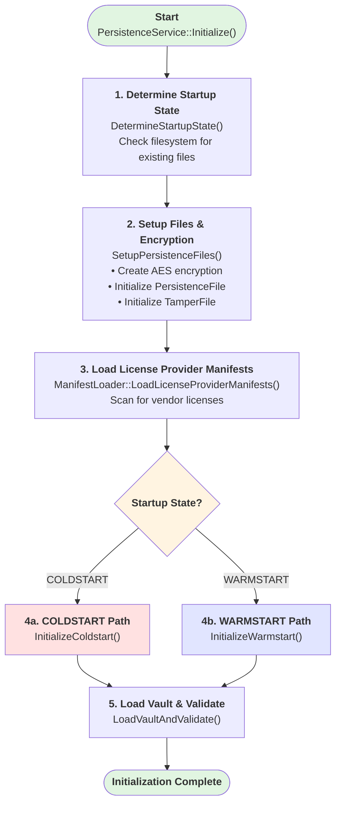
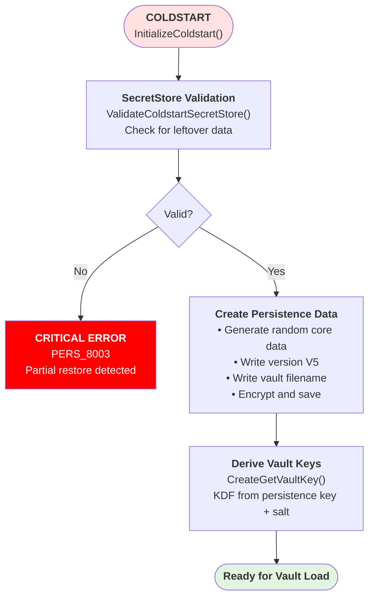
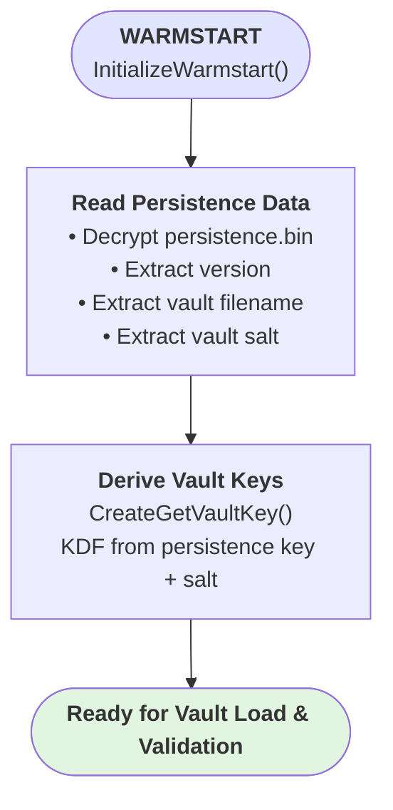
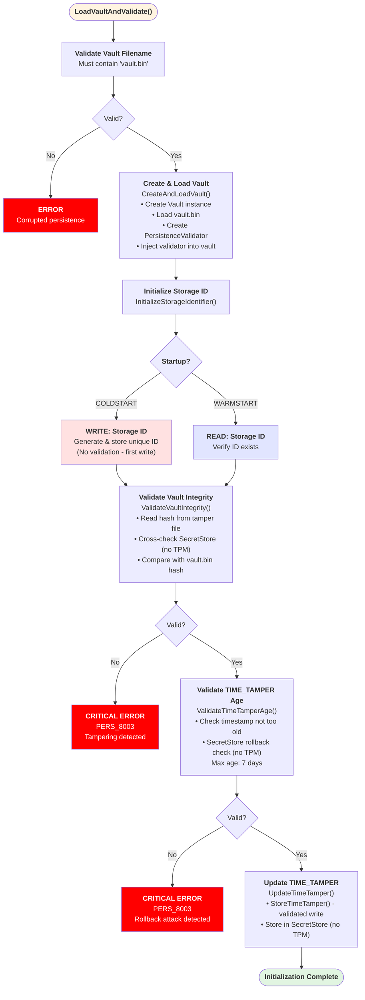
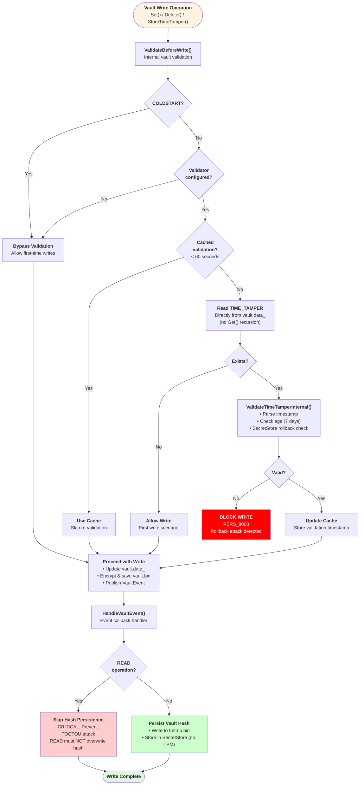

# Persistence Workflow

## Overview

This document describes the complete persistence initialization workflow for the TLLicenseManager, including COLDSTART (first run) and WARMSTART (subsequent runs) paths, with detailed security validations.

## High-Level Flow



## Detailed COLDSTART Flow



## Detailed WARMSTART Flow



## Vault Load & Validation Flow



## Vault Write Protection Flow



## Security Validations Summary

### 1. **Vault Integrity Check** (WARMSTART only)
- **When**: After vault load, before any writes
- **What**: Compares vault.bin hash against persisted hash
- **Sources**: 
  - Primary: tmtmp.bin (TamperFile)
  - Fallback: SecretStore (when TPM disabled)
- **Detects**: Vault file tampering, unauthorized modifications

### 2. **TIME_TAMPER Age Validation**
- **When**: 
  - Startup (explicit check)
  - Before every vault write (cached, 60s window)
- **What**: Validates timestamp is not too old (max 7 days)
- **Extra Check**: SecretStore cross-validation for clock rollback detection
- **Detects**: 
  - Outdated backup restorations
  - Rollback attacks
  - Clock manipulation

### 3. **SecretStore Cross-Validation** (TPM disabled only)
- **When**: Both integrity and time validation
- **What**: Compares tamper file data with SecretStore data
- **Detects**:
  - Clock rollback (OS time < SecretStore time)
  - Inconsistencies between storage locations
  - Partial restore attacks

### 4. **COLDSTART SecretStore Validation**
- **When**: COLDSTART initialization
- **What**: Checks for leftover SecretStore data when persistence files missing
- **Detects**:
  - Incomplete cleanup after uninstall
  - Partial backup restoration
  - Tamper attempts via file deletion

### 5. **Write-Time Validation**
- **When**: Every vault write operation
- **What**: Re-validates TIME_TAMPER before allowing write
- **Performance**: 60-second cache to avoid overhead
- **Detects**: Runtime rollback attacks between startup and write operations

## Critical Security Guards

### TOCTOU Protection (Time-of-Check Time-of-Use)
```cpp
// In HandleVaultEvent() - CRITICAL security guard
if (event.Op == VaultOp::Read) {
    return; // Skip hash persistence for READ operations
}
```

**Why Critical**: Without this guard, READ operations would overwrite the legitimate hash BEFORE validation, defeating the integrity check entirely.

**Attack Without Guard**:
1. Attacker modifies vault.bin
2. System loads → READ event → overwrites hash with tampered hash
3. ValidateVaultIntegrity() compares tampered vault vs tampered hash = ✓ PASS (false positive)

**With Guard**:
1. Attacker modifies vault.bin  
2. System loads → READ event → **skipped** (no hash update)
3. ValidateVaultIntegrity() compares tampered vault vs legitimate hash = ✗ FAIL (correct detection)

## File Locations

- **persistence.bin**: Encrypted core data (version, vault filename, salt)
- **vault.bin**: Encrypted vault data (storage ID, TIME_TAMPER, keys)
- **tmtmp.bin**: Tamper detection file (vault hash, operation log)
- **SecretStore**: OS-protected storage (VaultHash, TimeTamper - TPM disabled only)

## Key Methods Reference

| Method | File | Line | Purpose |
|--------|------|------|---------|
| `Initialize()` | PersistenceService.cpp | ~177 | Main entry point |
| `DetermineStartupState()` | PersistenceService.cpp | ~649 | Detect COLD/WARMSTART |
| `SetupPersistenceFiles()` | PersistenceService.cpp | ~694 | Create file handlers |
| `InitializeColdstart()` | PersistenceService.cpp | ~234 | First-run initialization |
| `InitializeWarmstart()` | PersistenceService.cpp | ~294 | Subsequent-run initialization |
| `CreateAndLoadVault()` | PersistenceService.cpp | ~416 | Create vault & validator |
| `ValidateVaultIntegrity()` | PersistenceValidator.cpp | ~27 | Hash integrity check |
| `ValidateTimeTamperAge()` | PersistenceValidator.cpp | ~126 | Timestamp age check |
| `ValidateTimeTamperInternal()` | PersistenceValidator.cpp | ~137 | Internal timestamp validation |
| `ValidateBeforeWrite()` | Vault.cpp | ~226 | Pre-write validation guard |
| `HandleVaultEvent()` | PersistenceService.cpp | ~744 | Event callback with TOCTOU guard |

## Error Codes

- **PERS_8003**: Critical persistence error (tampering, rollback, integrity failure)
- **PERS_8005**: Initialization failure (setup, permissions, exceptions)

## TPM vs No-TPM Differences

| Feature | With TPM | Without TPM (File-Based) |
|---------|----------|--------------------------|
| Vault encryption keys | Hardware-sealed | Software-only |
| SecretStore validation | Skipped (redundant) | Active (cross-validation) |
| Rollback detection | Basic (timestamp age) | Enhanced (SecretStore time check) |
| Hash cross-check | Single source (tmtmp.bin) | Dual source (tmtmp.bin + SecretStore) |
| Security level | High (HW tamper resistance) | Medium (requires multiple checks) |

## Testing Scenarios

1. **COLDSTART Test**: Delete all persistence files, verify clean initialization
2. **WARMSTART Test**: Normal startup, verify integrity checks pass
3. **Tampering Test**: Modify vault.bin, verify PERS_8003 error
4. **Rollback Test**: Restore old backup, verify age check fails
5. **Clock Rollback Test**: Set system clock backwards, verify detection (no TPM)
6. **Partial Restore Test**: Restore files but not SecretStore, verify COLDSTART fails (no TPM)
7. **Performance Test**: Multiple writes within 60s, verify cache usage

