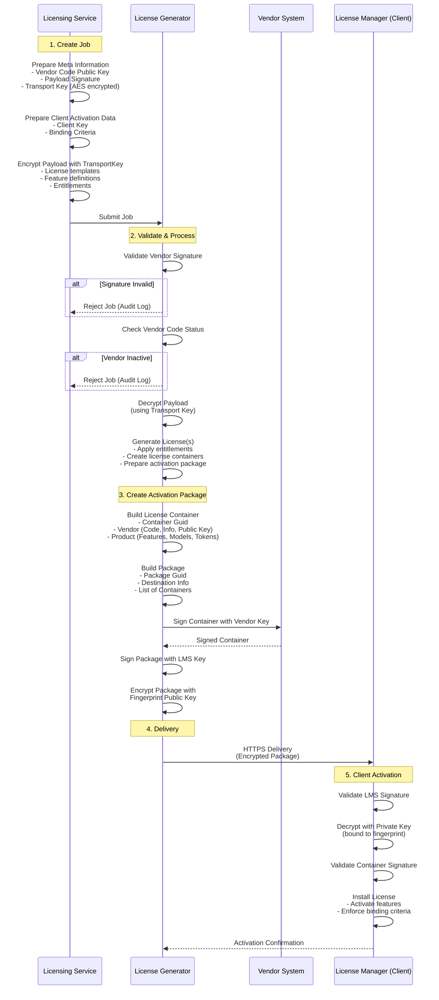

# License Generation Flow Diagram

**Version:** 1.0  
**Created:** 31 January 2026  
**Last Updated:** 31 January 2026  

**Document Purpose:** Visual representation of the end-to-end license generation workflow, from job creation through client activation.

---

## Overview

This diagram illustrates the secure data exchange between the Licensing Service and License Generator, including vendor authentication, payload encryption, package creation, and client-side activation.

---

## License Generation Sequence

---

## Process Steps

### 1. Job Creation (Licensing Service)
- Prepares meta information with vendor credentials
- Encrypts payload with ephemeral transport key
- Includes client activation data and binding criteria

### 2. Validation & Processing (License Generator)
- Validates vendor signature and status
- Decrypts payload using transport key
- Generates licenses based on entitlements

### 3. Package Creation
- Builds license containers with vendor and product information
- Signs containers with vendor key
- Signs and encrypts package with client fingerprint

### 4. Secure Delivery
- Transmits encrypted package via HTTPS
- End-to-end encryption ensures confidentiality

### 5. Client Activation
- Validates signatures from LMS and vendor
- Decrypts package with hardware-bound private key
- Installs and enforces license binding

---

## Security Features

- **Vendor Authentication:** Signature validation at every step
- **Payload Encryption:** Transport keys for secure data exchange
- **Hardware Binding:** Fingerprint-based encryption
- **Multi-Signature:** Both vendor and LMS sign critical components
- **Audit Logging:** Failed validations logged for security monitoring

---

## Related Documents

- [LicenseGeneration.md](LicenseGeneration.md) - Detailed workflow documentation
- [Activation.md](../LMS/Activation/Activation.md) - Activation structure and security
- [Crypto Entities.md](Crypto%20Entities.md) - Cryptographic key infrastructure

---

<!--
GENERATION PROMPT:

Create a visual flow diagram for the license generation process including:
- Sequence diagram showing all participants (Licensing Service, License Generator, Vendor, Client)
- Step-by-step workflow from job creation to client activation
- Decision points for validation failures
- Cryptographic operations at each stage
- Security considerations and features

Use Mermaid sequenceDiagram format for clarity and maintainability.

Update timestamp to current date/time: 
[System.Globalization.CultureInfo]::CurrentCulture = [System.Globalization.CultureInfo]::GetCultureInfo('en-US'); Get-Date -Format 'dd MMMM yyyy HH:mm'
-->
