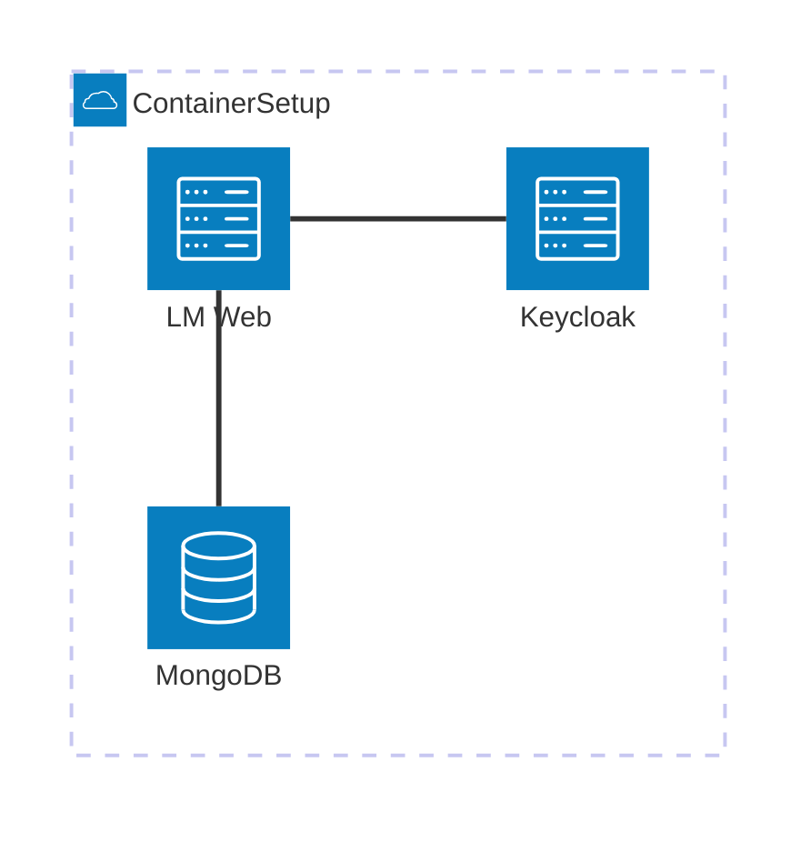

# Vendor Deployment
## Vendor OnBoarding
1. Create in VendorBoard
1.1. __VENDOR_ROOT__ is the default vendor secret used for deployment
1.1. Create at least an additional secret
1.2. Setup license
## Instance Creation
2. Obtain Vendor Deployment secret
2.1. Prepare Container for exclusive or shared usage
2.1.1. LMS Web Instance
2.1.2. Keycloak
2.1.3. Create Container Secret for LMS Web with Keycloak Config
2.1.4. Create Container Secret for Databases depending on shared or exclusive cluster installation

