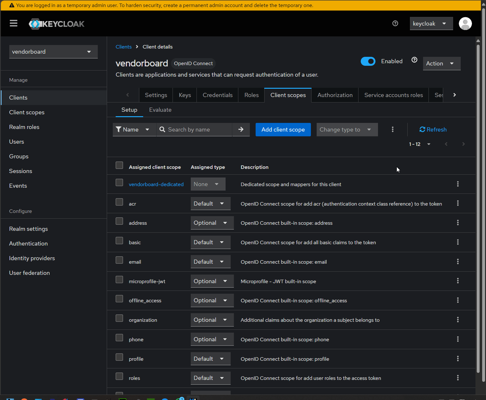
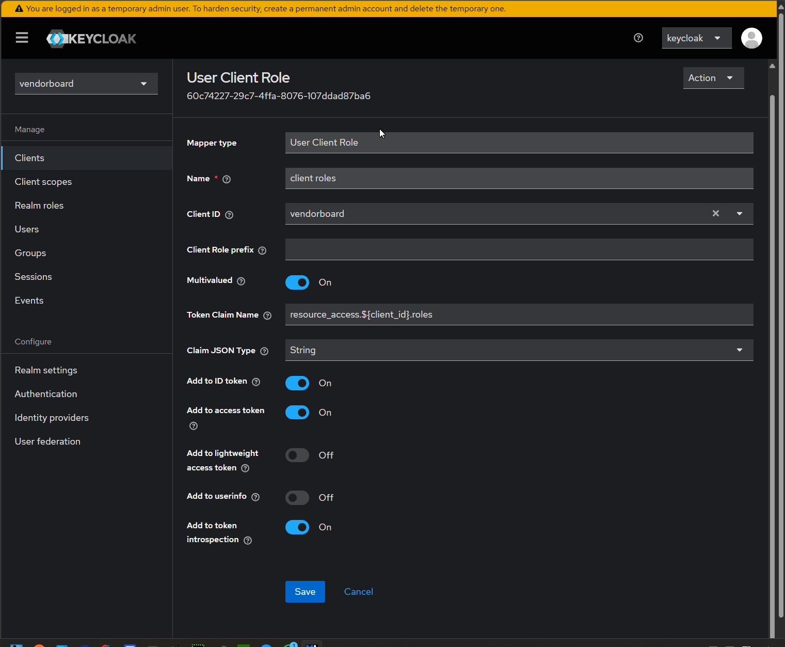

# KeyCloak
### Add client role claims via mapper
In newer keycloak versions (right now 20) the click path is: client -> (pick yours) -> client scopes -> pick the first (dedicated client scope) -> add mappers

