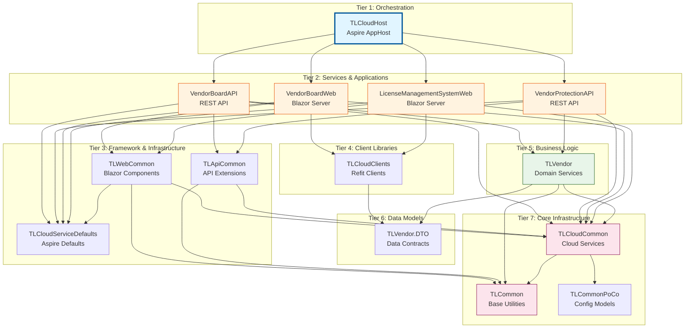
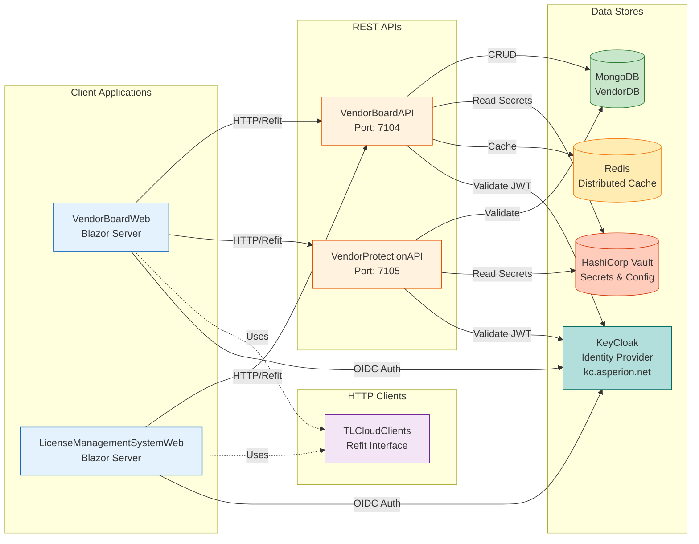

# TLCloud Project Dependencies

## Overview
Hierarchical project structure for TLCloud solution orchestrated by .NET Aspire AppHost.

---

## Architecture Layers

**Tier 1: Orchestration**
- TLCloudHost - Aspire AppHost

**Tier 2: Services & Applications**  
- VendorBoardAPI, VendorBoardWeb, VendorProtectionAPI, LicenseManagementSystemWeb

**Tier 3-7:** Framework ? Clients ? Business Logic ? DTOs ? Core Infrastructure

---

## Text Dependency Tree
	
---

## Mermaid: Full Architecture



## Mermaid: Service Communication



## Mermaid: Licensing Provider Flow

```mermaid
sequenceDiagram
    participant User
    participant VendorBoardWeb
    participant ILicensingProviderApi
    participant VendorBoardAPI
    participant LicensingProviderService
    participant MongoDB
    participant Vault
    
    User->>VendorBoardWeb: Navigate to app
    activate VendorBoardWeb
    VendorBoardWeb->>VendorBoardWeb: AuthLayout.OnInitializedAsync()
    VendorBoardWeb->>ILicensingProviderApi: LicensingProviderConfiguredAsync()
    activate ILicensingProviderApi
    ILicensingProviderApi->>VendorBoardAPI: GET /LicensingProviderConfigured
    activate VendorBoardAPI
    VendorBoardAPI->>LicensingProviderService: LicensingProviderConfigured()
    activate LicensingProviderService
    LicensingProviderService->>MongoDB: CountDocumentsAsync(filter, limit: 1)
    activate MongoDB
    MongoDB-->>LicensingProviderService: count: 0
    deactivate MongoDB
    LicensingProviderService-->>VendorBoardAPI: Response&lt;bool&gt; { Data = false }
    deactivate LicensingProviderService
    VendorBoardAPI-->>ILicensingProviderApi: false
    deactivate VendorBoardAPI
    ILicensingProviderApi-->>VendorBoardWeb: false
    deactivate ILicensingProviderApi
    VendorBoardWeb->>User: Show initialization form
    deactivate VendorBoardWeb
    
    User->>VendorBoardWeb: Fill form & click Initialize Provider
    activate VendorBoardWeb
    VendorBoardWeb->>ILicensingProviderApi: InitializeLicensingProviderAsync(name, externalId, description)
    activate ILicensingProviderApi
    ILicensingProviderApi->>VendorBoardAPI: POST /InitializeLicensingProvider
    activate VendorBoardAPI
    VendorBoardAPI->>LicensingProviderService: InitializeLicensingProvider(name, externalId, description)
    activate LicensingProviderService
    
    LicensingProviderService->>Vault: Get ProviderEncryptionAESKey
    activate Vault
    Vault-->>LicensingProviderService: AES Key (Base64)
    deactivate Vault
    
    LicensingProviderService->>LicensingProviderService: Check FastCrypt setting
    LicensingProviderService->>LicensingProviderService: GenerateRsaKeyPair(keySize: 2048 or 4096)
    LicensingProviderService->>LicensingProviderService: AesCrypt.AesEncrypt(privateKey, aesKey)
    
    LicensingProviderService->>MongoDB: InsertOneAsync(encryptedProvider)
    activate MongoDB
    MongoDB-->>LicensingProviderService: Success
    deactivate MongoDB
    
    LicensingProviderService-->>VendorBoardAPI: LicensingProviderDto (decrypted)
    deactivate LicensingProviderService
    VendorBoardAPI-->>ILicensingProviderApi: LicensingProviderDto
    deactivate VendorBoardAPI
    ILicensingProviderApi-->>VendorBoardWeb: LicensingProviderDto
    deactivate ILicensingProviderApi
    
    VendorBoardWeb->>VendorBoardWeb: NotificationService.Notify(Success)
    VendorBoardWeb->>VendorBoardWeb: Set _licensingOk = true
    VendorBoardWeb->>User: Render @Body content
    deactivate VendorBoardWeb
```

---

## Key Components
- **APIs**: VendorBoardController, LicensingProviderController  
- **Services**: LicensingProviderService (AES encryption, RSA key gen)
- **Shared**: VaultInitializer, KeyCloakOpenId, AesCrypt

## Technology Stack
.NET 10, Aspire, Blazor Server, MongoDB, Vault, KeyCloak, Radzen, Refit, Mapster

*Last Updated: 2024*