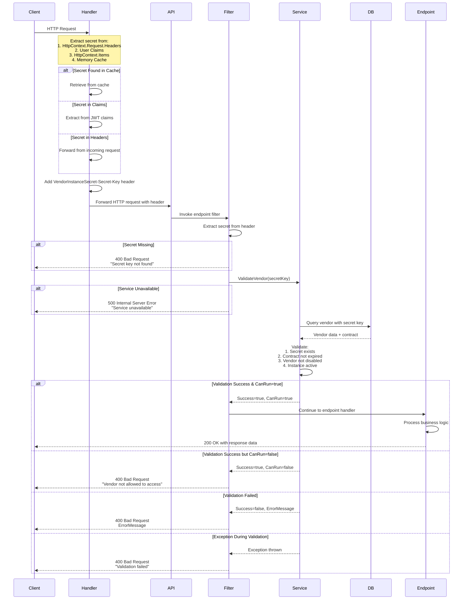

# VendorHeaderFilter Analysis

## Overview
`VendorHeaderFilter` is a critical security component in the TLCloud multi-tenant architecture that validates vendor instance secret keys and enforces authorization at the API endpoint level.

---

## Architecture Components

### 1. VendorHeaderFilter Design

**Location:** `VendorProtectionAPI\Extensions\VendorHeaderFilter.cs`

**Dual Purpose Implementation:**

#### A. Runtime Security (IEndpointFilter)
- Intercepts incoming HTTP requests before they reach endpoint handlers
- Validates `VendorInstanceSecret-Secret-Key` header
- Calls `VendorProtectionService.ValidateVendor()` to verify authorization
- Returns appropriate HTTP status codes (400/500/200)

#### B. API Documentation (IOperationFilter)
- Automatically adds vendor secret header to OpenAPI/Swagger specification
- Documents the header as **required** for all filtered endpoints
- Improves developer experience by making the requirement explicit

---

## Security Flow



---

## HTTP Status Code Matrix

| Condition | Status Code | Response |
|-----------|-------------|----------|
| Secret missing | 400 | null (sets status code directly) |
| Service unavailable | 500 | null (sets status code directly) |
| Validation success + CanRun=true | 200 | Continues to endpoint |
| Validation success + CanRun=false | 400 | `Results.BadRequest("Vendor not allowed...")` |
| Validation failed | 400 | `Results.BadRequest(errorMessage)` |
| Exception during validation | 400 | `Results.BadRequest("Validation failed")` |

---

## Service Dependencies

### VendorProtectionService.ValidateVendor()

**Expected Response Structure:**

```json
{
  "success": true|false,
  "canRun": true|false,
  "errorMessage": "string"
}
```

- **success**: Indicates if the validation was successful.
- **canRun**: Indicates if the vendor is allowed to access the requested resource.
- **errorMessage**: Contains error details if `success` is false.

**Caching Behavior:**
- Successful validations (`isValid: true`) are cached for **performance optimization**.
- Cache duration and invalidation policies are managed internally.

---

## Summary

**VendorHeaderFilter** is a critical security component providing:
- ✅ **Multi-tenant isolation** via secret key validation
- ✅ **Defense-in-depth** architecture with multiple validation layers
- ✅ **Developer-friendly** automatic Swagger documentation
- ✅ **Production-ready** comprehensive error handling and logging
- ✅ **Performance-optimized** caching strategy
- ✅ **Secure by design** fail-safe defaults and partial secret logging

This filter is **essential for all vendor-specific APIs** in the TLCloud platform and works in conjunction with JWT authentication to provide complete authorization for multi-tenant SaaS operations.

---

## Related Documentation

- [VendorInstanceSecretHandler Implementation](../TLWebCommon/Handlers/VendorInstanceSecretHandler.cs)
- [VendorSecretValidationMiddleware](../VendorBoardAPI/Middleware/VendorSecretValidationMiddleware.cs)
- [VendorProtectionService](../TLVendor/Service/VendorProtectionService.cs)
- [Multi-Tenant Architecture Overview](../../docs/MultiTenantArchitecture.md)
- [Security Best Practices](../../docs/SecurityBestPractices.md)

---

**Last Updated:** January 2025  
**Version:** 1.0  
**Maintainer:** TLCloud Architecture Team
