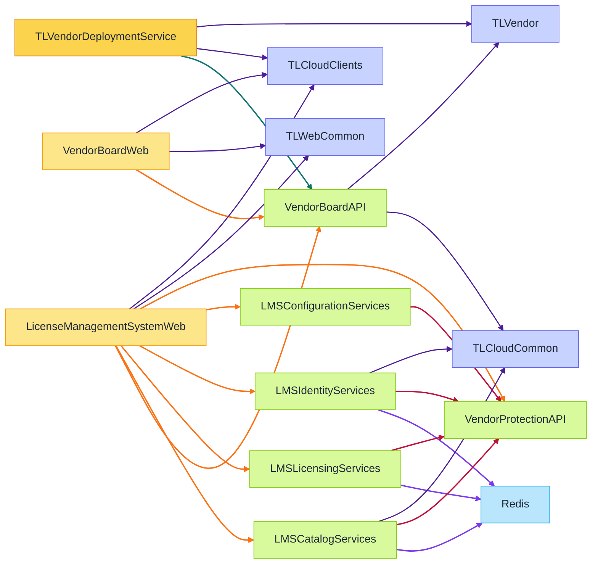

# TLCloud - Project Dependency Graph

This diagram shows project-to-project dependencies and shared libraries.

```mermaid
flowchart LR
  %% Web UIs
  vendorboardweb["VendorBoardWeb"]
  lmsweb["LicenseManagementSystemWeb"]

  %% Background
  tldepsvc["TLVendorDeploymentService"]

  %% APIs
  vendorboardapi["VendorBoardAPI"]
  vendorprotectionapi["VendorProtectionAPI"]
  lmscatalog["LMSCatalogServices"]
  lmslic["LMSLicensingServices"]
  lmsid["LMSIdentityServices"]
  lmsconf["LMSConfigurationServices"]

  %% Libraries
  tlwebcommon["TLWebCommon"]
  tlcloudcommon["TLCloudCommon"]
  tlcloudclients["TLCloudClients"]
  tlvendor["TLVendor"]

  %% Infra / Data
  redis["Redis"]

  %% Styling
  classDef web fill:#fde68a,stroke:#f59e0b,stroke-width:1px,color:#1f2937
  classDef api fill:#d9f99d,stroke:#84cc16,stroke-width:1px,color:#1f2937
  classDef background fill:#fcd34d,stroke:#d97706,stroke-width:1px,color:#1f2937
  classDef library fill:#c7d2fe,stroke:#6366f1,stroke-width:1px,color:#1f2937
  classDef datastore fill:#bae6fd,stroke:#0ea5e9,stroke-width:1px,color:#1f2937

  class vendorboardweb,lmsweb web
  class vendorboardapi,vendorprotectionapi,lmscatalog,lmslic,lmsid,lmsconf api
  class tldepsvc background
  class tlwebcommon,tlcloudcommon,tlcloudclients,tlvendor library
  class redis datastore

  %% Web -> APIs
  vendorboardweb --> vendorboardapi
  lmsweb --> vendorboardapi
  lmsweb --> lmscatalog
  lmsweb --> lmslic
  lmsweb --> lmsid
  lmsweb --> lmsconf
  lmsweb --> vendorprotectionapi

  %% APIs -> Infra
  lmscatalog --> redis
  lmslic --> redis
  lmsid --> redis

  %% API -> API
  lmscatalog --> vendorprotectionapi
  lmslic --> vendorprotectionapi
  lmsid --> vendorprotectionapi
  lmsconf --> vendorprotectionapi

  %% Background -> API
  tldepsvc --> vendorboardapi

  %% Shared libraries
  vendorboardweb --> tlwebcommon
  vendorboardweb --> tlcloudclients
  lmsweb --> tlwebcommon
  lmsweb --> tlcloudclients
  vendorboardapi --> tlcloudcommon
  vendorboardapi --> tlvendor
  lmscatalog --> tlcloudcommon
  lmsid --> tlcloudcommon
  tldepsvc --> tlcloudclients
  tldepsvc --> tlvendor

  %% Link styling (0-indexed by render order)
  linkStyle 0,1,2,3,4,5,6 stroke:#f97316,stroke-width:2px,color:#1f2937
  linkStyle 7,8,9 stroke:#7c3aed,stroke-width:2px,color:#1f2937
  linkStyle 10,11,12,13 stroke:#be123c,stroke-width:2px,color:#1f2937
  linkStyle 14 stroke:#0f766e,stroke-width:2px,color:#1f2937
  linkStyle 15,16,17,18,19,20,21,22,23,24 stroke:#4c1d95,stroke-width:1.6px,color:#1f2937

```

