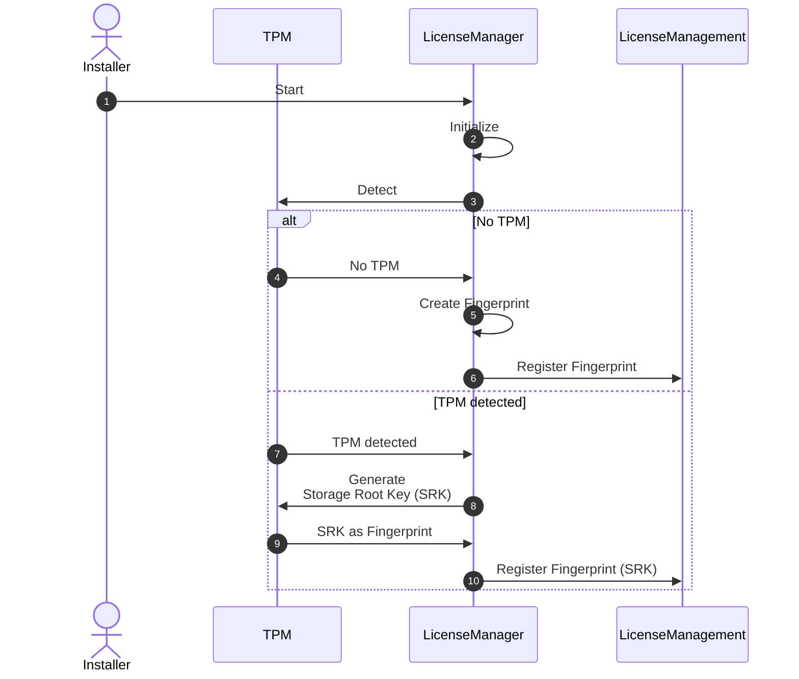

# License Manager Registration

```mermaid
sequenceDiagram
    autonumber
    actor Installer
    participant TPM
    participant LM as LicenseManager
    participant LMS as LicenseManagement
    
    Installer->>LM: Start
    LM->>LM: Initialize
    LM->>TPM: Detect
    alt No TPM
        TPM->>LM: No TPM
        LM->>LM: Create Fingerprint
        LM->>LMS: Register Fingerprint
    else TPM detected
        TPM->>LM: TPM detected
        LM->>TPM: Generate<br/>Storage Root Key (SRK)
        TPM->>LM: SRK as Fingerprint
        LM->>LMS: Register Fingerprint (SRK)
    end
```

---

**Source:** Converted from [LicenseManagerRegistrtion.plantuml](LicenseManagerRegistrtion.plantuml)
