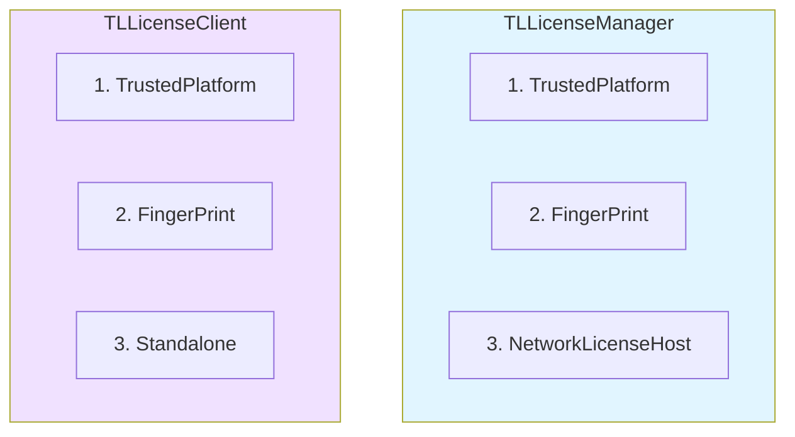

# Packaging

```mermaid
graph TB
    subgraph TLLicenseManager
        TLM1["1. TrustedPlatform"]
        TLM2["2. FingerPrint"]
        TLM3["3. NetworkLicenseHost"]
    end
    
    subgraph TLLicenseClient
        TLC1["1. TrustedPlatform"]
        TLC2["2. FingerPrint"]
        TLC3["3. Standalone"]
    end
    
    style TLLicenseManager fill:#e1f5ff
    style TLLicenseClient fill:#f0e1ff
```

---

**Source:** Converted from [Packaging.plantuml](Packaging.plantuml)
